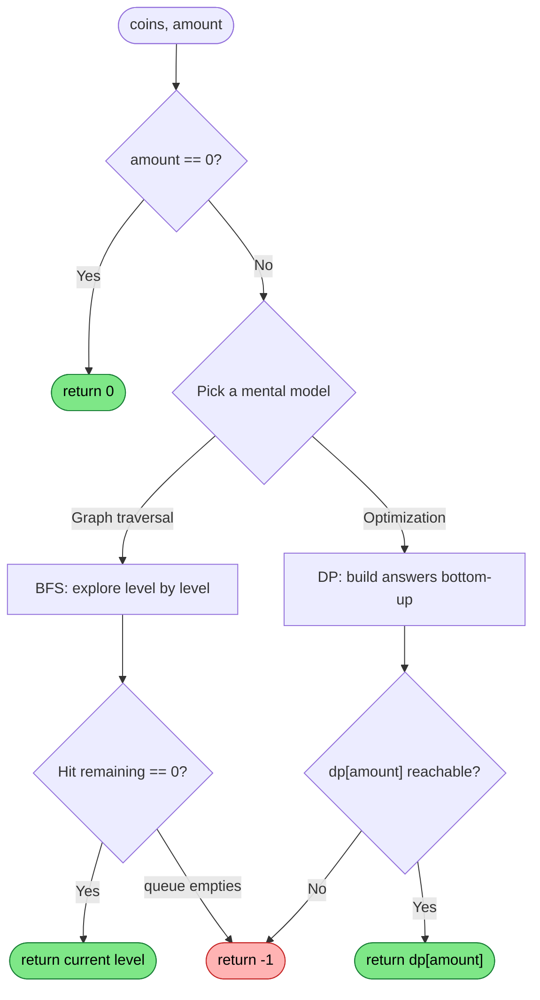
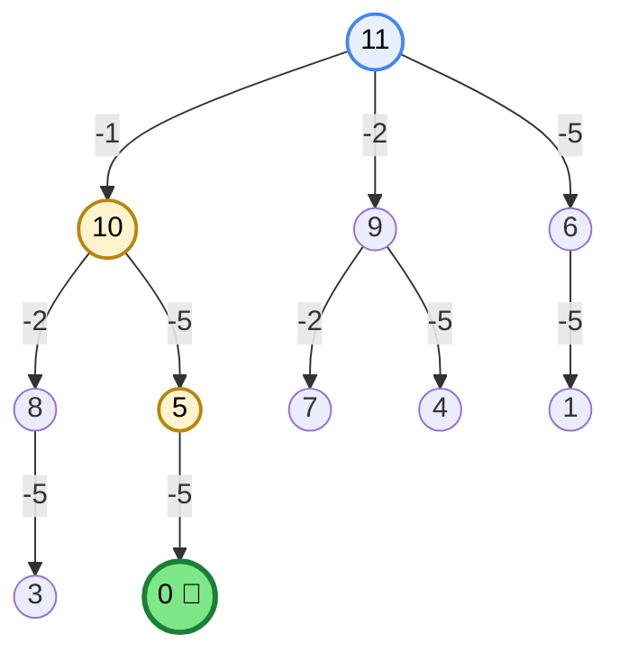
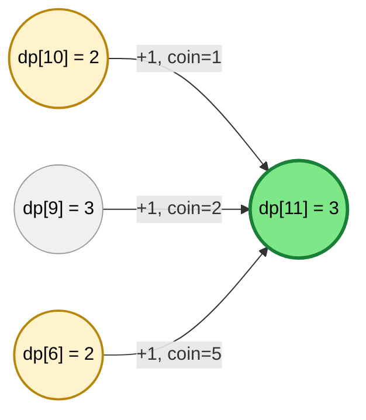
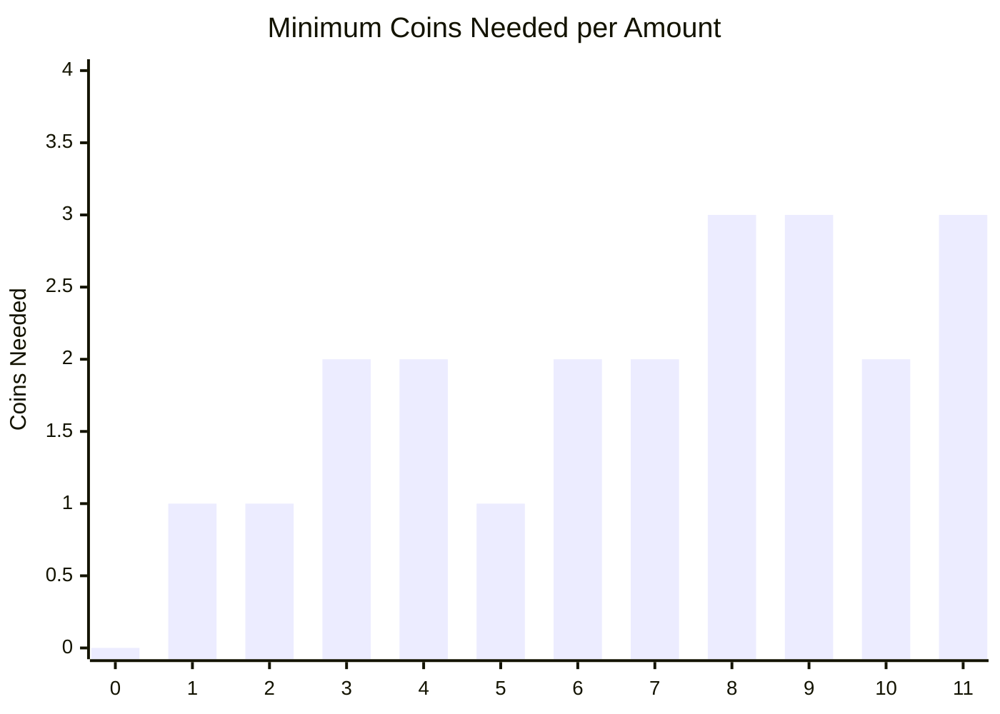
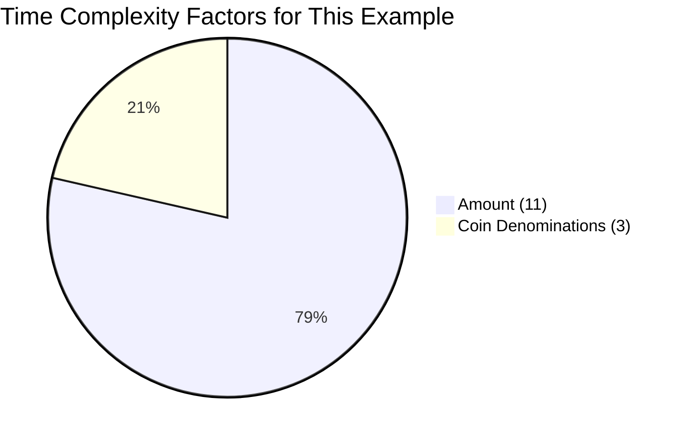
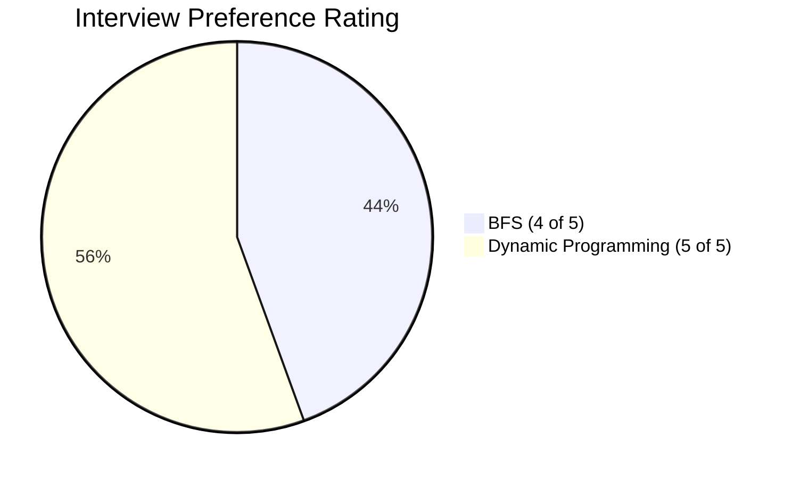

# 322. Coin Change

<p align="center">


</p>

<p align="center">
<a href="https://leetcode.com/problems/coin-change/">🔗 Problem on LeetCode</a>
</p>

> Two ways to think about the same problem: as a **graph to search**, or a **table to fill**.

## 📑 Table of Contents

- [Problem](#-problem)
- [Example](#example)
- [Visual Overview](#-visual-overview)
- [Approach 1: BFS](#approach-1--breadth-first-search-bfs)
- [Approach 2: Dynamic Programming](#approach-2--dynamic-programming-bottom-up)
- [BFS vs DP Comparison](#bfs-vs-dp-comparison)
- [Key Learnings](#key-learnings)
- [Topics Covered](#topics-covered)

---

## 🔗 Problem

Given an integer array `coins` representing different coin denominations and an integer `amount` representing the total amount of money.

Return the **fewest number of coins** needed to make up that amount.

If it is not possible to make up the amount, return `-1`.

---

## Example

### Input

```text
coins = [1,2,5]
amount = 11
```

### Output

```text
3
```

### Explanation

```text
11 = 5 + 5 + 1
```

Only **3 coins** are required.

---

## 🎯 Visual Overview

Before going into either approach, here's the decision both solutions are making under the hood:



Both approaches walk through the exact same state space (`0` to `amount`) — BFS walks it top-down from `amount`, DP walks it bottom-up from `0`.

---

# Approach 1 : Breadth First Search (BFS)

## Intuition

Think of every remaining amount as a graph node.

Each coin creates a new state by subtracting its value from the current amount.

Example

```text
Amount = 11

                11
          /      |      \
       10        9        6
      / | \     ...      ...
```

Each edge represents using **one coin**.

Since every edge has the same cost, **BFS guarantees the shortest path**, which is the minimum number of coins.

### 🌳 The Actual BFS Tree for `coins = [1,2,5], amount = 11`

Here's that same idea fully drawn out and traced against the real algorithm:



The gold path — **11 → 10 → 5 → 0** — is the first path to hit `0`, using coins `{1, 5, 5}` in 3 steps. Branches that land on an already-visited amount (pruned by the `visited` set) are left out here for clarity — the full trace below accounts for every single one of them.

<details>
<summary>📋 Full BFS dry-run trace, verified against the actual code (click to expand)</summary>

| Level | Node | Coin Tried | Remaining | Result |
|:---:|:---:|:---:|:---:|:---|
| 1 | 11 | 1 | 10 | 🆕 enqueue |
| 1 | 11 | 2 | 9 | 🆕 enqueue |
| 1 | 11 | 5 | 6 | 🆕 enqueue |
| 2 | 10 | 1 | 9 | ⏭️ already visited |
| 2 | 10 | 2 | 8 | 🆕 enqueue |
| 2 | 10 | 5 | 5 | 🆕 enqueue |
| 2 | 9 | 1 | 8 | ⏭️ already visited |
| 2 | 9 | 2 | 7 | 🆕 enqueue |
| 2 | 9 | 5 | 4 | 🆕 enqueue |
| 2 | 6 | 1 | 5 | ⏭️ already visited |
| 2 | 6 | 2 | 4 | ⏭️ already visited |
| 2 | 6 | 5 | 1 | 🆕 enqueue |
| 3 | 8 | 1 | 7 | ⏭️ already visited |
| 3 | 8 | 2 | 6 | ⏭️ already visited |
| 3 | 8 | 5 | 3 | 🆕 enqueue |
| 3 | 5 | 1 | 4 | ⏭️ already visited |
| 3 | 5 | 2 | 3 | ⏭️ already visited |
| 3 | 5 | 5 | 0 | 🎯 **found — return 3** |

`minCoins` increments once per level (1 → 2 → 3), matching the outer `while` loop in the code below.

</details>

---

## Algorithm

1. Start from the target amount.
2. Store it in a queue.
3. For every remaining amount:
   - Subtract every coin.
   - If the remaining amount becomes `0`, return the current BFS level.
4. Use a visited set to avoid processing the same remaining amount multiple times.
5. If the queue becomes empty, return `-1`.

---

## BFS Code

```java
class Solution {

    public int coinChange(int[] coins, int amount) {

        if (amount == 0)
            return 0;

        HashSet<Integer> visited = new HashSet<>();
        Queue<Integer> queue = new ArrayDeque<>();

        queue.offer(amount);
        visited.add(amount);

        int minCoins = 0;

        while (!queue.isEmpty()) {

            minCoins++;

            int size = queue.size();

            while (size-- > 0) {

                int current = queue.poll();

                for (int coin : coins) {

                    int remaining = current - coin;

                    if (remaining == 0)
                        return minCoins;

                    if (remaining > 0 && !visited.contains(remaining)) {

                        visited.add(remaining);
                        queue.offer(remaining);

                    }

                }

            }

        }

        return -1;
    }
}
```

<details>
<summary>🐍 Python Solution</summary>

```python
from collections import deque
from typing import List


class Solution:
    def coinChange(self, coins: List[int], amount: int) -> int:
        if amount == 0:
            return 0

        visited = {amount}
        queue = deque([amount])
        min_coins = 0

        while queue:
            min_coins += 1

            for _ in range(len(queue)):
                current = queue.popleft()

                for coin in coins:
                    remaining = current - coin

                    if remaining == 0:
                        return min_coins

                    if remaining > 0 and remaining not in visited:
                        visited.add(remaining)
                        queue.append(remaining)

        return -1
```

</details>

---

## BFS Complexity

### Time Complexity

```text
O(amount × number_of_coins)
```

### Space Complexity

```text
O(amount)
```

---

# Approach 2 : Dynamic Programming (Bottom-Up)

## Intuition

Let

```text
dp[i]
```

represent the **minimum number of coins required to make amount i**.

Base Case

```text
dp[0] = 0
```

For every amount,

try every possible coin.

Transition

```text
dp[i] = min(dp[i], dp[i - coin] + 1)
```

---

## DP Table Example

For

```text
coins = [1,2,5]
amount = 11
```

| Amount | 0 | 1 | 2 | 3 | 4 | 5 | 6 | 7 | 8 | 9 | 10 | 11 |
|--------:|--:|--:|--:|--:|--:|--:|--:|--:|--:|--:|---:|---:|
| dp | 0 | 1 | 1 | 2 | 2 | 1 | 2 | 2 | 3 | 3 | 2 | 3 |

Answer

```text
dp[11] = 3
```

### 🔗 How `dp[11]` Actually Gets Built



`dp[11] = min(dp[10]+1, dp[9]+1, dp[6]+1) = min(3, 4, 3) = 3`. Two different last coins — `1` (from `dp[10]`) or `5` (from `dp[6]`) — both reach the optimum. DP guarantees the minimum *value*; it doesn't promise a unique path to it.

### 📊 Minimum Coins Needed, per Amount



Notice the dips at `5` and `10` — whenever the amount lines up with a bigger coin, the answer drops back down.

<details>
<summary>📋 Full DP dry-run — every <code>dp[i]</code> computed, verified against the actual code (click to expand)</summary>

| i | coin 1 → `dp[i-1]` | coin 2 → `dp[i-2]` | coin 5 → `dp[i-5]` | `dp[i] = min(...) + 1` |
|:---:|:---:|:---:|:---:|:---:|
| 1 | dp[0] = 0 | — | — | **1** |
| 2 | dp[1] = 1 | dp[0] = 0 | — | **1** |
| 3 | dp[2] = 1 | dp[1] = 1 | — | **2** |
| 4 | dp[3] = 2 | dp[2] = 1 | — | **2** |
| 5 | dp[4] = 2 | dp[3] = 2 | dp[0] = 0 | **1** |
| 6 | dp[5] = 1 | dp[4] = 2 | dp[1] = 1 | **2** |
| 7 | dp[6] = 2 | dp[5] = 1 | dp[2] = 1 | **2** |
| 8 | dp[7] = 2 | dp[6] = 2 | dp[3] = 2 | **3** |
| 9 | dp[8] = 3 | dp[7] = 2 | dp[4] = 2 | **3** |
| 10 | dp[9] = 3 | dp[8] = 3 | dp[5] = 1 | **2** |
| 11 | dp[10] = 2 | dp[9] = 3 | dp[6] = 2 | **3** |

`—` means that coin can't be used yet (`i - coin < 0`).

</details>

---

## Algorithm

1. Create a DP array of size `amount + 1`.
2. Initialize all values to `Integer.MAX_VALUE`.
3. Set `dp[0] = 0`.
4. For every amount from `1` to `amount`:
   - Try every coin.
   - If the previous state is reachable:
     - Update the minimum answer.
5. Return `-1` if the amount is still unreachable.

---

## DP Code

```java
class Solution {

    public int coinChange(int[] coins, int amount) {

        if (amount == 0)
            return 0;

        int[] dp = new int[amount + 1];

        Arrays.fill(dp, Integer.MAX_VALUE);

        dp[0] = 0;

        for (int i = 1; i <= amount; i++) {

            for (int coin : coins) {

                if (coin <= i && dp[i - coin] != Integer.MAX_VALUE) {

                    dp[i] = Math.min(dp[i], dp[i - coin] + 1);

                }

            }

        }

        return dp[amount] == Integer.MAX_VALUE ? -1 : dp[amount];

    }
}
```

<details>
<summary>🐍 Python Solution</summary>

```python
from typing import List


class Solution:
    def coinChange(self, coins: List[int], amount: int) -> int:
        if amount == 0:
            return 0

        dp = [float("inf")] * (amount + 1)
        dp[0] = 0

        for i in range(1, amount + 1):
            for coin in coins:
                if coin <= i and dp[i - coin] != float("inf"):
                    dp[i] = min(dp[i], dp[i - coin] + 1)

        return dp[amount] if dp[amount] != float("inf") else -1
```

</details>

---

## DP Complexity

### Time Complexity

```text
O(amount × number_of_coins)
```

### Space Complexity

```text
O(amount)
```

---

# BFS vs DP Comparison

| Feature | BFS | DP |
|----------|-----|----|
| Idea | Graph Traversal | Optimization |
| Core CS Principle | Unweighted Shortest Path | Optimal Substructure + Overlapping Subproblems |
| Data Structure | Queue + HashSet | DP Array |
| Traversal | Level Order | Bottom-Up |
| Early Exit | ✅ Yes | ❌ No |
| Time Complexity | O(amount × coins) | O(amount × coins) |
| Space Complexity | O(amount) | O(amount) |
| Interview Preference | ⭐⭐⭐⭐☆ | ⭐⭐⭐⭐⭐ |

### ⚖️ Same Big-O, Different Feel

Both approaches share the exact same time complexity formula — `O(amount × coins)`. For this problem's specific example (`amount = 11`, `3` coins), here's how much each factor actually weighs in:



The `amount` dimension dominates — this is why both approaches scale with the **target value**, not the number of coin types. It's also why Coin Change is described as *pseudo-polynomial*: fast for small amounts, slow if `amount` gets huge, no matter how few coin types you have.



DP is the expected answer in most interviews, but bringing up BFS as a second approach — and explaining *why* it also works — signals you understand the problem structurally, not just as a memorized "DP pattern."

---

# Key Learnings

- BFS models the problem as an **unweighted shortest path** problem.
- Dynamic Programming models the problem as an **optimization** problem.
- Both approaches have the same asymptotic complexity.
- Bottom-Up DP is the most commonly expected solution in coding interviews.
- BFS is an excellent alternative that demonstrates strong graph problem-solving skills.

---

## Topics Covered

<p align="left">


</p>
