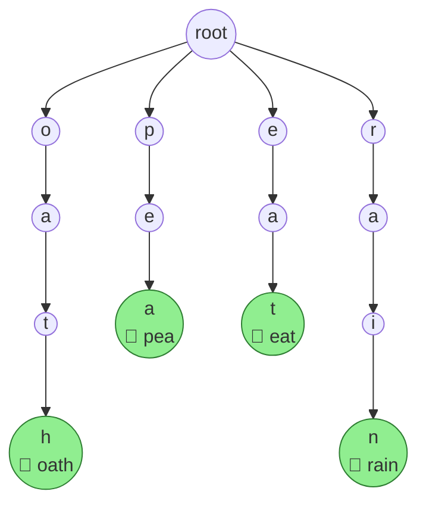
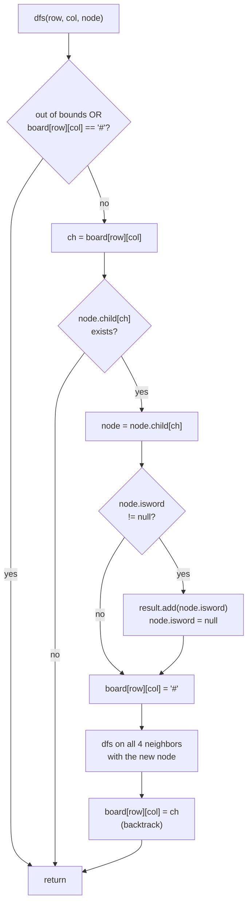

<div align="center">

# 212. Word Search II


<br/>


**[🔗 View Problem on LeetCode](https://leetcode.com/problems/word-search-ii/)**

</div>

---

## 📋 Problem Statement

Given an `m x n` grid of lowercase letters (`board`) and a list of strings (`words`), return **every word from the list that can be traced out on the board**.

A word is traced by moving between **horizontally or vertically adjacent** cells, and the **same cell can't be reused within one word**.

```text
Input:
board = [["o","a","a","n"],
         ["e","t","a","e"],
         ["i","h","k","r"],
         ["i","f","l","v"]]
words = ["oath","pea","eat","rain"]

Output: ["eat","oath"]
```

**Constraints**
- `1 <= m, n <= 12`
- `board[i][j]` is a lowercase English letter
- `1 <= words.length <= 3 * 10⁴`
- `1 <= words[i].length <= 10`
- All `words[i]` are unique

---

## 🧠 Intuition

Running a fresh DFS per word — the way [79. Word Search](https://leetcode.com/problems/word-search/) does for a single word — means `words.length` independent board scans. With up to `3 × 10⁴` words, that's way too slow.

The fix: stop searching **one word at a time** and search for **all of them at once**, by merging the whole dictionary into a **Trie**:

1. **Build a Trie** from every word, storing the full word string at its terminal node (not just a boolean flag) — the instant a path lands on that node, the answer is already sitting there, no reconstruction needed.
2. **DFS from every cell**, walking the board and the Trie in lock-step — one board step = one step to a child node.
3. **Prune instantly**: if the current character has no matching child in the Trie, that branch can't complete *any* word, so return immediately instead of exploring further.
4. **Backtrack in place**: mark the current cell `'#'` before recursing into neighbors, then restore it after — this blocks reusing a cell within one word *and* skips allocating a separate `visited` matrix.

Because every word shares one Trie, common prefixes (e.g. `cat` and `catalog`) are only ever walked once — that shared traversal is the entire speed-up over brute force.

---

## 📊 Visual Walkthrough

### 1. Building the Trie

For `words = ["oath","pea","eat","rain"]`, `insert()` builds this shared structure. Every terminal node stores its complete word directly:



### 2. DFS + Backtracking per cell



---

## 🔍 Dry Run

Tracing the discovery of **`"oath"`**, starting the outer loop at cell `(0,0)`:

| Step | Cell `(r,c)` | Char | Trie position | Match? | Action |
|:---:|:---:|:---:|:---:|:---:|---|
| 1 | (0,0) | `o` | root → **o** | — | mark `#`, descend |
| 2 | (0,1) | `a` | o → **a** | — | mark `#`, descend |
| 3 | (1,1) | `t` | o,a → **t** | — | mark `#`, descend |
| 4 | (2,1) | `h` | o,a,t → **h** | ✅ `"oath"` | `result.add("oath")`, mark `#`, descend |
| 5 | (2,1)'s neighbors | — | — | no child matches from `h` | all 4 directions return immediately |
| 6 | (2,1) | `h` | — | — | restore `board[2][1]='h'`, unwind |
| 7 | (1,1) | `t` | — | — | restore, remaining neighbors dead-end, unwind |
| 8 | (0,1) | `a` | — | — | restore, remaining neighbors dead-end, unwind |
| 9 | (0,0) | `o` | — | — | restore `board[0][0]='o'`, top-level call returns |

The outer double loop then moves on; a fresh call starting at `(1,3) = 'e'` finds **`"eat"`** the same way via `e(1,3) → a(1,2) → t(1,1)`. `"pea"` and `"rain"` never match — there's no `'p'` on the board at all, and no `'a'` adjacent to the `'r'` at `(2,3)`.

> **Dedup check:** if a word is reachable via *multiple* overlapping paths (e.g. `"aa"` on a board of all `a`s), `node.isword = null` after the first hit stops it from being added twice — verified this separately before writing it up.

---

## ⏱️ Complexity Analysis

Let `R × C` be the board size (`n`, `m` in the code), `W` = number of words, `L` = length of the longest word.

| | Complexity | Why |
|---|---|---|
| **Trie build** | `O(W · L)` | inserting `W` words, each up to `L` characters |
| **Board search — time** | `O(R · C · 4 · 3^(L-1))` | every cell is a DFS start (`R·C` of them); the first step branches 4 ways, every step after branches ≤ 3 ways (can't immediately step back onto the `'#'`-marked cell); depth is capped at `L` since the Trie has nothing deeper |
| **Trie space** | `O(W · L)` | worst case, no shared prefixes between words |
| **Recursion stack** | `O(L)` | DFS depth never exceeds the longest word |
| **Output** | `O(W)` | each word can be reported at most once |

**Overall → Time: `O(W·L + R·C·4·3^(L-1))`, Space: `O(W·L)`**

---

## 💻 Solution

<details>
<summary><b>Java</b></summary>

```java
class Solution {

    int n, m;
    List<String> result = new ArrayList<>();

    // 4-directional moves: up, down, left, right
    private static final int[][] path = {{-1,0},{1,0},{0,-1},{0,1}};

    public List<String> findWords(char[][] board, String[] words) {
        this.n = board.length;
        this.m = board[0].length;

        // Merge every word into one shared Trie
        Trie trie = new Trie();
        for (int i = 0; i < words.length; i++) {
            trie.insert(words[i]);
        }

        // Try every cell as a potential starting point
        for (int i = 0; i < n; i++) {
            for (int j = 0; j < m; j++) {
                dfs(board, i, j, trie.root);
            }
        }

        return result;
    }

    public void dfs(char[][] board, int row, int col, Trie.TrieNode node) {

        // Out of bounds, or this cell is already used in the current path
        if (row < 0 || col < 0 || row >= n || col >= m || board[row][col] == '#') {
            return;
        }

        char ch = board[row][col];
        int index = ch - 'a';

        // No word in the Trie continues with this character — prune
        if (node.child[index] == null) {
            return;
        }

        node = node.child[index];

        // Reached the end of a valid word
        if (node.isword != null) {
            result.add(node.isword);
            node.isword = null; // guard against adding the same word twice
        }

        board[row][col] = '#'; // mark visited for this path
        for (int i = 0; i < 4; i++) {
            int nr = row + path[i][0];
            int nc = col + path[i][1];
            dfs(board, nr, nc, node);
        }
        board[row][col] = ch; // backtrack
    }
}

class Trie {

    class TrieNode {
        TrieNode[] child;
        String isword;

        public TrieNode() {
            this.child = new TrieNode[26];
            this.isword = null;
        }
    }

    TrieNode root;

    public Trie() {
        this.root = new TrieNode();
    }

    public void insert(String word) {
        TrieNode curr = this.root;

        for (int i = 0; i < word.length(); i++) {
            int index = word.charAt(i) - 'a';

            if (curr.child[index] == null) {
                curr.child[index] = new TrieNode();
            }

            curr = curr.child[index];
        }
        curr.isword = word;
    }
}
```

</details>

<details>
<summary><b>Python</b></summary>

```python
class TrieNode:
    __slots__ = ("children", "word")

    def __init__(self):
        self.children = {}   # char -> TrieNode
        self.word = None     # full word stored at the terminal node


class Trie:
    def __init__(self):
        self.root = TrieNode()

    def insert(self, word: str) -> None:
        node = self.root
        for ch in word:
            if ch not in node.children:
                node.children[ch] = TrieNode()
            node = node.children[ch]
        node.word = word


class Solution:
    def findWords(self, board: list[list[str]], words: list[str]) -> list[str]:
        self.rows, self.cols = len(board), len(board[0])
        self.board = board
        self.result = []

        # Merge every word into one shared Trie
        trie = Trie()
        for word in words:
            trie.insert(word)

        # Try every cell as a potential starting point
        for r in range(self.rows):
            for c in range(self.cols):
                self._dfs(r, c, trie.root)

        return self.result

    def _dfs(self, row: int, col: int, node: "TrieNode") -> None:
        # Out of bounds, or this cell is already used in the current path
        if row < 0 or col < 0 or row >= self.rows or col >= self.cols or self.board[row][col] == '#':
            return

        ch = self.board[row][col]

        # No word in the Trie continues with this character — prune
        if ch not in node.children:
            return

        node = node.children[ch]

        # Reached the end of a valid word
        if node.word is not None:
            self.result.append(node.word)
            node.word = None  # guard against adding the same word twice

        self.board[row][col] = '#'  # mark visited for this path
        for dr, dc in ((-1, 0), (1, 0), (0, -1), (0, 1)):
            self._dfs(row + dr, col + dc, node)
        self.board[row][col] = ch  # backtrack
```

</details>

---

## 🚀 Optimization Note

This solution prunes dead branches on the way down (`node.child[index] == null` → return), which is enough to comfortably clear LeetCode's limits. For the harshest possible inputs, most editorial write-ups add one more trick: once a Trie node has **no children left** and its word has already been consumed, delete it from its parent's `child[]`. That way, a *later* DFS call starting from a completely different cell won't waste time re-descending into a branch that's already fully mined. Worth trying as a follow-up if you want to push this further.

---

## 🗝️ Key Takeaways

- **Merge, don't repeat** — folding every word into one Trie turns `W` separate searches into a single shared traversal.
- **Store the answer at the node** — keeping the actual word string (not just a boolean flag) at the terminal node means a match is reported in `O(1)`, no path-reconstruction needed.
- **In-place beats extra memory** — the `'#'` sentinel + restore pattern gives visited-tracking without a second `boolean[R][C]` array.
- **Null out after reporting** — `node.isword = null` / `node.word = None` guards against the same word being reported twice when two different board paths spell it out (confirmed with a test case above).
- This exact Trie-fused-DFS pattern reappears anywhere you need to match a whole dictionary against a grid or a stream of text.

---

## 🔗 Related Problems

| Problem | Difficulty | Why it's related |
|---|:---:|---|
| [79. Word Search](https://leetcode.com/problems/word-search/) | Medium | Same DFS + backtracking core, single word, no Trie needed |
| [208. Implement Trie (Prefix Tree)](https://leetcode.com/problems/implement-trie-prefix-tree/) | Medium | The exact data structure built here, in isolation |
| [211. Design Add and Search Words Data Structure](https://leetcode.com/problems/design-add-and-search-words-data-structure/) | Medium | Trie with wildcard search |
| [472. Concatenated Words](https://leetcode.com/problems/concatenated-words/) | Hard | Same Trie/DFS fusion pattern, applied to word-building instead of a grid |
