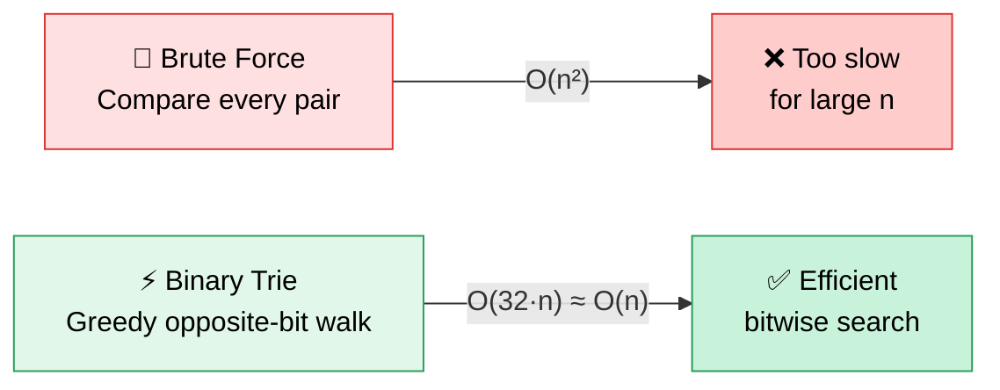
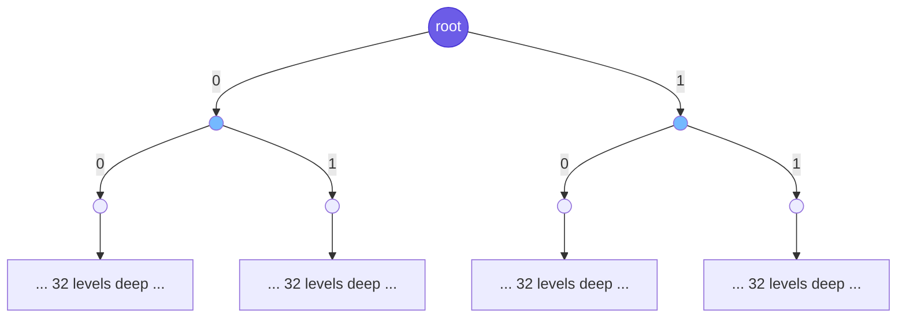
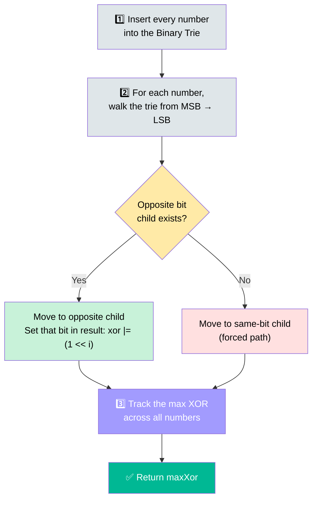
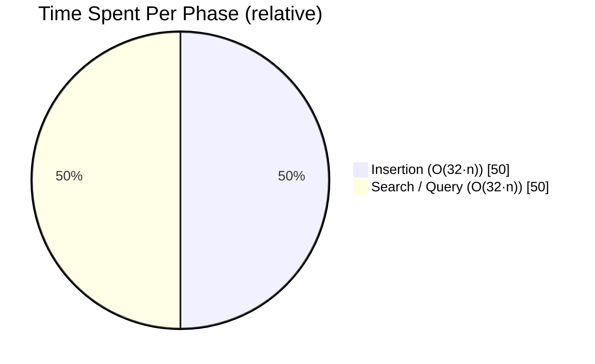
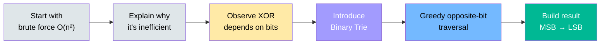

<div align="center">

# 🔢 421. Maximum XOR of Two Numbers in an Array

### Bit Manipulation • Binary Trie • Greedy Strategy


-brightgreen?style=for-the-badge)
-informational?style=for-the-badge)

*Turning an O(n²) brute force into O(32·n) using a bit-trie*

</div>

---

## 📌 Problem Statement

Given an integer array `nums`, return the **maximum value** of:

```
nums[i] XOR nums[j]
```

**Constraints:** `0 <= i < nums.length`, `0 <= j < nums.length`, `i != j`

<table>
<tr><th>Input</th><th>Output</th><th>Explanation</th></tr>
<tr>
<td>

```
nums = [3,10,5,25,2,8]
```

</td>
<td align="center">

```
28
```

</td>
<td>

`5 XOR 25 = 28`

</td>
</tr>
</table>

---

## 🚦 Brute Force vs. Optimized



| Approach | Time Complexity | Space Complexity | Verdict |
|---|:---:|:---:|---|
| 🐢 Brute Force (Nested Loops) | `O(n²)` | `O(1)` | Simple, but slow at scale |
| ⚡ **Binary Trie + Greedy** | **`O(32·n) ≈ O(n)`** | **`O(32·n) ≈ O(n)`** | ✅ Optimal — interview standard |

---

## 💡 Core Idea

XOR is maximized when the two bits **differ**:

| Bit A | Bit B | XOR |
|:---:|:---:|:---:|
| 0 | 0 | 0 |
| 0 | 1 | **1** |
| 1 | 0 | **1** |
| 1 | 1 | 0 |

> 🎯 **Greedy insight:** for every number, walk a binary trie of all numbers from the **Most Significant Bit (bit 31)** down to bit 0, and at each step greedily jump to the **opposite bit** if it exists — this guarantees the largest possible XOR.

---

## 🌳 The Binary Trie

Every number is inserted as a path of 32 bits (MSB → LSB). Each node has at most two children: `0` and `1`.



**Example — inserting `5` (binary `00101`):**

```
Root → 0 → 0 → 1 → 0 → 1
```

---

## 🚀 Algorithm Walkthrough



---

## 📖 Dry Run

**Input:** `nums = [5, 25]`

| Number | Binary (5-bit) |
|---|---|
| 5 | `00101` |
| 25 | `11001` |

**Goal:** find the max XOR achievable with `5`.

<details>
<summary>🔍 <b>Click to expand full bit-by-bit trie walk</b></summary>

| Step | Bit Position | Bit of `5` | Opposite Bit Available? | Action | Running XOR (binary) |
|:---:|:---:|:---:|:---:|---|:---:|
| 1 | 4 | `0` | ✅ `1` exists (from 25) | Take opposite → set bit | `10000` |
| 2 | 3 | `0` | ✅ `1` exists | Take opposite → set bit | `11000` |
| 3 | 2 | `1` | ✅ `0` exists | Take opposite → set bit | `11100` |
| 4 | 1 | `0` | ❌ only same bit `0` | Forced same path | `11100` |
| 5 | 0 | `1` | ❌ only same bit `1` | Forced same path | `11100` |

**Final XOR (binary):** `11100` → **Decimal: `28`** ✅

</details>

---

## 🧩 Java Implementation (Primary)

```java
class Solution {

    public int findMaximumXOR(int[] nums) {

        Trie trie = new Trie();

        for (int num : nums) {
            trie.insert(num);
        }

        int maxXor = 0;

        for (int num : nums) {
            maxXor = Math.max(maxXor, trie.getMaxXor(num));
        }

        return maxXor;
    }
}

class Trie {

    class TrieNode {
        TrieNode zero;
        TrieNode one;
    }

    TrieNode root;

    public Trie() {
        root = new TrieNode();
    }

    public void insert(int num) {

        TrieNode curr = root;

        for (int i = 31; i >= 0; i--) {

            int bit = (num >> i) & 1;

            if (bit == 0) {
                if (curr.zero == null) curr.zero = new TrieNode();
                curr = curr.zero;
            } else {
                if (curr.one == null) curr.one = new TrieNode();
                curr = curr.one;
            }
        }
    }

    public int getMaxXor(int num) {

        TrieNode curr = root;
        int xor = 0;

        for (int i = 31; i >= 0; i--) {

            int bit = (num >> i) & 1;

            if (bit == 0) {
                if (curr.one != null) {
                    xor |= (1 << i);
                    curr = curr.one;
                } else {
                    curr = curr.zero;
                }
            } else {
                if (curr.zero != null) {
                    xor |= (1 << i);
                    curr = curr.zero;
                } else {
                    curr = curr.one;
                }
            }
        }

        return xor;
    }
}
```

<details>
<summary>🐍 <b>Click to expand equivalent Python solution</b></summary>

```python
class TrieNode:
    def __init__(self):
        self.zero = None
        self.one = None


class Trie:
    def __init__(self):
        self.root = TrieNode()

    def insert(self, num: int) -> None:
        curr = self.root
        for i in range(31, -1, -1):
            bit = (num >> i) & 1
            if bit == 0:
                if curr.zero is None:
                    curr.zero = TrieNode()
                curr = curr.zero
            else:
                if curr.one is None:
                    curr.one = TrieNode()
                curr = curr.one

    def get_max_xor(self, num: int) -> int:
        curr = self.root
        xor = 0
        for i in range(31, -1, -1):
            bit = (num >> i) & 1
            if bit == 0:
                if curr.one is not None:
                    xor |= (1 << i)
                    curr = curr.one
                else:
                    curr = curr.zero
            else:
                if curr.zero is not None:
                    xor |= (1 << i)
                    curr = curr.zero
                else:
                    curr = curr.one
        return xor


class Solution:
    def findMaximumXOR(self, nums: list[int]) -> int:
        trie = Trie()
        for num in nums:
            trie.insert(num)

        max_xor = 0
        for num in nums:
            max_xor = max(max_xor, trie.get_max_xor(num))

        return max_xor
```

</details>

---

## ⏱ Complexity Analysis



| Phase | Work per Number | Total for n Numbers |
|---|:---:|:---:|
| 🌱 Insertion | `O(32)` | `O(32 × n)` |
| 🔍 Search | `O(32)` | `O(32 × n)` |
| **Total Time** | — | **`O(32 × n) ≈ O(n)`** |
| **Total Space** | — | **`O(32 × n) ≈ O(n)`** |

---

## 🎯 Key Observations

- ✅ XOR is maximized when bits **differ** — that's the whole greedy engine.
- ✅ Always process from the **Most Significant Bit** downward.
- ✅ Greedily choose the **opposite bit** whenever the trie has that path.
- ✅ Each query resolves in a fixed **O(32)** — independent of `n`.

---

## 📚 Concepts Used

<div align="center">

| 🧮 Bit Manipulation | 🌳 Binary Trie | 🎯 Greedy Strategy | ⚡ XOR Properties | 🌲 Tree Traversal | ⏱ Complexity Optimization |
|:---:|:---:|:---:|:---:|:---:|:---:|

</div>

---

## 🎤 Interview Takeaways



> 💬 This pattern — **Binary Trie for bitwise maximization** — shows up repeatedly in product-based company interviews and signals strong command of bit manipulation, tries, and greedy design.

---

<div align="center">

⭐ **If this helped, drop a star on the repo!** ⭐

</div>
