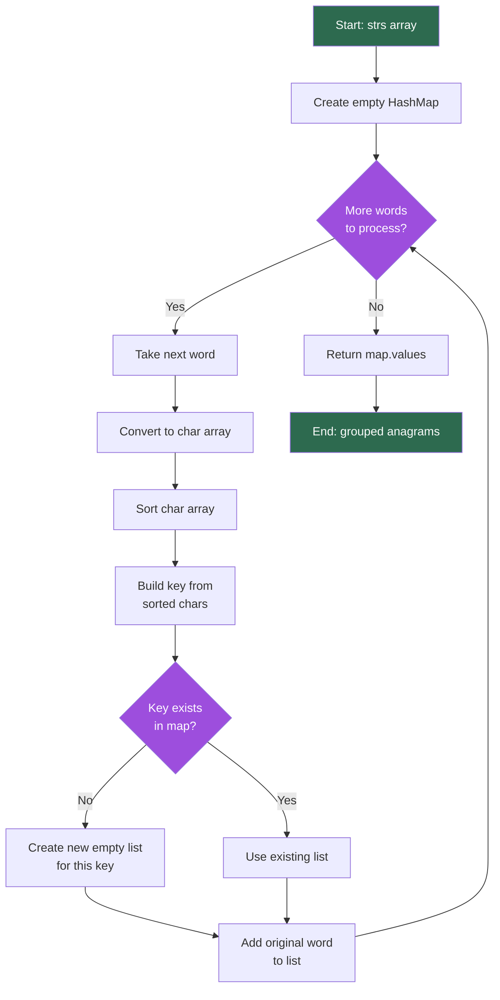
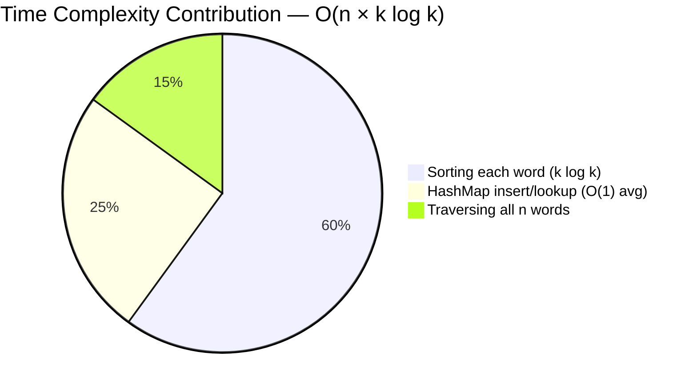

# 49. Group Anagrams

<div align="center">


</div>

## 📌 Problem Statement

Given an array of strings `strs`, group the anagrams together. You can return the answer in **any order**.

An **anagram** is a word or phrase formed by rearranging the letters of another word, using all the original letters exactly once.

### Example 1

```text
Input:  strs = ["eat","tea","tan","ate","nat","bat"]
Output: [["bat"],["nat","tan"],["ate","eat","tea"]]
```

### Example 2

```text
Input:  strs = [""]
Output: [[""]]
```

### Example 3

```text
Input:  strs = ["a"]
Output: [["a"]]
```

### Constraints

```text
1 <= strs.length <= 10^4
0 <= strs[i].length <= 100
strs[i] consists of lowercase English letters only
```

---

## 💡 Intuition

Two strings are anagrams **if and only if** they contain exactly the same characters with exactly the same frequencies.

That means every anagram of a word shares one thing in common: a **canonical form**.

```text
eat → aet
tea → aet
ate → aet
```

If we can compute a canonical form that is identical for all anagrams of each other (and different otherwise), we can use it as a **HashMap key** and bucket every string into its group in a single pass.

Two ways to build that canonical form:

| Canonical Form | How | Cost per word |
|---|---|---|
| **Sorted string** | `Arrays.sort(chars)` | `O(k log k)` |
| **Character frequency signature** | count each of the 26 letters | `O(k)` |

Both are covered below — sorting first (simple, most common in interviews), then the frequency-count optimization.

---

## 🚀 Approach (Sorting + HashMap)

1. Create a `HashMap<String, List<String>>` to hold groups.
2. Traverse each word in the input array.
3. Convert the word into a character array.
4. Sort the character array → this becomes the **key**.
5. Convert the sorted array back into a `String`.
6. If the key isn't in the map, insert a new empty list for it.
7. Append the **original** word to the list at that key.
8. Return all values of the map as the final grouped result.

---

## 🧩 Flow Diagram



---

## 🔍 Dry Run

**Input:** `["eat","tea","tan","ate","nat","bat"]`

| Step | Word | Sorted Key | Map State After Insert |
|:---:|:---:|:---:|---|
| 1 | `eat` | `aet` | `{aet: [eat]}` |
| 2 | `tea` | `aet` | `{aet: [eat, tea]}` |
| 3 | `tan` | `ant` | `{aet: [eat, tea], ant: [tan]}` |
| 4 | `ate` | `aet` | `{aet: [eat, tea, ate], ant: [tan]}` |
| 5 | `nat` | `ant` | `{aet: [eat, tea, ate], ant: [tan, nat]}` |
| 6 | `bat` | `abt` | `{aet: [eat, tea, ate], ant: [tan, nat], abt: [bat]}` |

**Final Output:**

```text
[
    ["eat", "tea", "ate"],
    ["tan", "nat"],
    ["bat"]
]
```

---

## 💻 Solutions

### Java (Primary) — Sorting Approach

```java
import java.util.*;

class Solution {
    public List<List<String>> groupAnagrams(String[] strs) {

        Map<String, List<String>> map = new HashMap<>();

        for (String word : strs) {
            char[] chars = word.toCharArray();
            Arrays.sort(chars);
            String key = new String(chars);

            // computeIfAbsent avoids the manual containsKey check
            map.computeIfAbsent(key, k -> new ArrayList<>()).add(word);
        }

        return new ArrayList<>(map.values());
    }
}
```

### Java (Optimized) — Frequency Signature (No Sorting)

```java
import java.util.*;

class Solution {
    public List<List<String>> groupAnagrams(String[] strs) {

        Map<String, List<String>> map = new HashMap<>();

        for (String word : strs) {
            int[] count = new int[26];
            for (char c : word.toCharArray()) {
                count[c - 'a']++;
            }

            // Build a delimited key, e.g. "1#0#0#0#1#0..."
            StringBuilder sb = new StringBuilder();
            for (int freq : count) {
                sb.append('#').append(freq);
            }
            String key = sb.toString();

            map.computeIfAbsent(key, k -> new ArrayList<>()).add(word);
        }

        return new ArrayList<>(map.values());
    }
}
```

<details>
<summary>🐍 Python Solutions (click to expand)</summary>

### Python (Primary) — Sorting Approach

```python
from collections import defaultdict
from typing import List

class Solution:
    def groupAnagrams(self, strs: List[str]) -> List[List[str]]:
        groups = defaultdict(list)

        for word in strs:
            key = ''.join(sorted(word))
            groups[key].append(word)

        return list(groups.values())
```

### Python (Optimized) — Frequency Signature (No Sorting)

```python
from collections import defaultdict
from typing import List

class Solution:
    def groupAnagrams(self, strs: List[str]) -> List[List[str]]:
        groups = defaultdict(list)

        for word in strs:
            count = [0] * 26
            for ch in word:
                count[ord(ch) - ord('a')] += 1
            key = tuple(count)  # tuples are hashable, ready to use as dict key

            groups[key].append(word)

        return list(groups.values())
```

**Note:** Python's `tuple` is directly hashable, so there's no need to build a delimited string key like in Java — this makes the Python version slightly cleaner.

</details>

---

## ⏱ Complexity Analysis

Let:
- **n** = number of strings in the input array
- **k** = maximum length of a string

### Approach Comparison

| Approach | Time Complexity | Space Complexity | Sorting Needed? | Notes |
|---|:---:|:---:|:---:|---|
| Brute Force (compare every pair) | `O(n² × k)` | `O(n × k)` | No | Impractical for n up to 10⁴ |
| **Sorting + HashMap** | `O(n × k log k)` | `O(n × k)` | Yes | Simple, most common interview answer |
| **Frequency Signature + HashMap** | `O(n × k)` | `O(n × k)` | **No** | Fastest — avoids the `log k` factor |

### Why Frequency Signature Wins

```text
Sorting approach:     n words × (k log k) per word  →  O(n · k log k)
Frequency approach:   n words × (k) per word         →  O(n · k)
```

Since `k ≤ 100` here, the practical difference is small — but for interviews, being able to state *"I can drop the log factor by using a 26-length count array instead of sorting"* is a strong signal.

### Complexity Breakdown (Sorting Approach)



---

## 🎯 Key Observations

- Anagrams collapse to the **same canonical form** — either a sorted string or a 26-length frequency count.
- A `HashMap<String, List<String>>` (or `Map<Key, List>`) buckets every word into its group in one linear pass.
- `computeIfAbsent` (Java) / `defaultdict` (Python) removes the manual "does this key exist" check.
- Each original word is stored exactly once — the key is only a lookup label, never returned to the user.

---

## 🔑 Why Sorting (or Counting) Works

```text
eat → sorted → aet     count → a1 e1 t1
tea → sorted → aet     count → a1 e1 t1
ate → sorted → aet     count → a1 e1 t1
```

All three representations are identical → all three words belong in the same bucket, regardless of which canonical form is used.

---

## 📚 Data Structures Used

- `HashMap<String, List<String>>`
- `ArrayList<String>`
- `char[]` (character array)
- `int[26]` (frequency array, optimized approach)
- `Arrays.sort()`

---

## 🎯 Interview Takeaways

- **Start with brute force** (`O(n²)` pairwise comparison) to show you understand the naive solution, then pivot to hashing.
- **Sorting + HashMap** is the standard, expected answer — know it cold.
- **Frequency array (26-length)** is the follow-up optimization interviewers often ask for: *"Can you avoid sorting?"*
- Mention that the frequency-array key must be **delimited** in Java (`"1#0#0..."`) — without the delimiter, `[1,10]` and `[11,0]` could collide as `"110"`.
- Python's tuple-as-key trick (`tuple(count)`) is a clean way to sidestep the delimiter problem entirely.
- Edge cases to call out: empty strings (`""`), single-character strings, and duplicate words in the input.

---

## 🏷 Topics

`HashMap` · `String` · `Sorting` · `Arrays` · `Hashing` · `Anagrams`

---

## 🔗 Related Problems

- [242. Valid Anagram](https://leetcode.com/problems/valid-anagram/) — the single-pair version of this problem
- [438. Find All Anagrams in a String](https://leetcode.com/problems/find-all-anagrams-in-a-string/) — sliding window + frequency count
- [49. Group Anagrams](https://leetcode.com/problems/group-anagrams/) *(this problem)*
