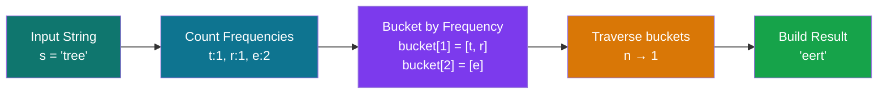
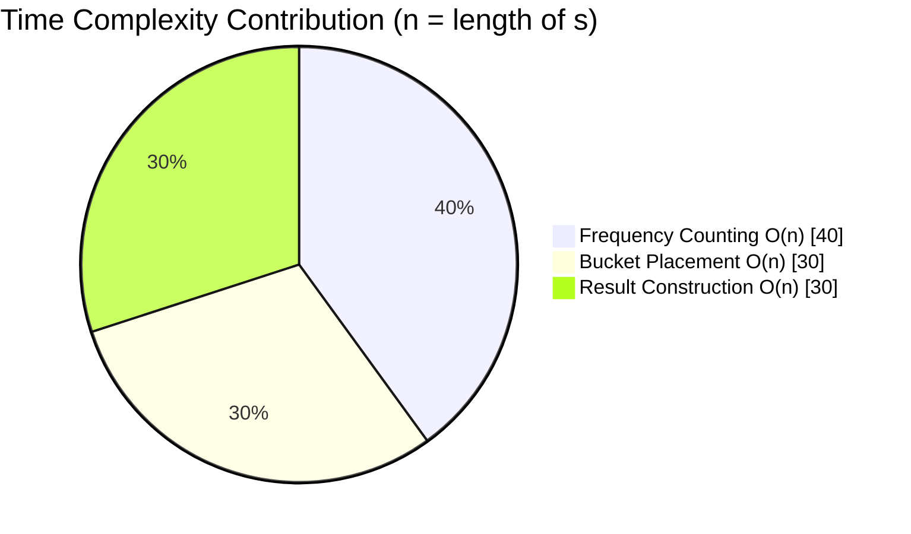
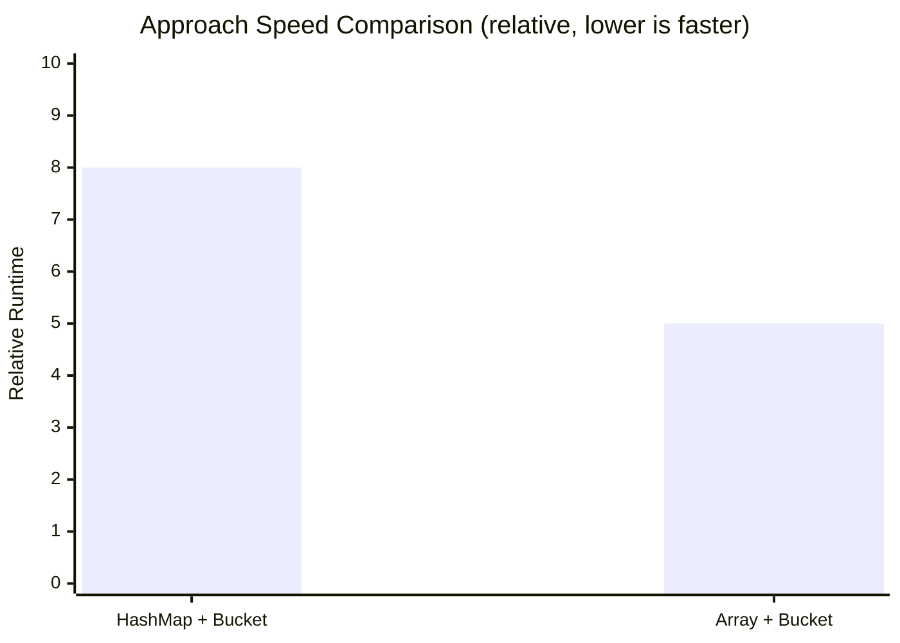

<h1 align="center">451. Sort Characters By Frequency</h1>

<p align="center">
  
  
  
  
</p>

<p align="center">
  <a href="https://leetcode.com/problems/sort-characters-by-frequency/">🔗 LeetCode Link</a>
</p>

---

## 📜 Problem Statement

Given a string `s`, sort it in **descending order based on the frequency of characters**. If two characters have the same frequency, their relative order does not matter.

### Example 1
```text
Input:  s = "tree"
Output: "eert"   (or "eetr")
```

### Example 2
```text
Input:  s = "cccaaa"
Output: "cccaaa"   (or "aaaccc")
```

---

## 🧠 Intuition

<p align="center">
  
</p>



The key insight: frequency can never exceed `n` (length of the string), so instead of sorting characters by frequency with an `O(n log n)` comparator, we can use **bucket sort** — index buckets directly by frequency (`0` to `n`) and read them off from high to low. This gives a linear **O(n)** solution.

---

## 🪣 Approach 1: HashMap + Bucket Sort

### Idea
1. Count the frequency of every character using a `HashMap`.
2. Create buckets where the index represents the frequency.
3. Place each character into its corresponding bucket.
4. Traverse the buckets from highest frequency to lowest.
5. Append each character `frequency` times to build the answer.

### Algorithm
1. Convert the string into a character array.
2. Count frequencies using a `HashMap<Character, Integer>`.
3. Create an array of `ArrayList<Character>` of size `n + 1`.
4. Store every character in the bucket corresponding to its frequency.
5. Traverse buckets from `n` down to `1`.
6. Append each character `frequency` times.
7. Return the resulting string.

<details>
<summary>💻 Java Solution</summary>

```java
class Solution {
    public String frequencySort(String s) {
        Map<Character, Integer> freqMap = new HashMap<>();
        for (char c : s.toCharArray()) {
            freqMap.put(c, freqMap.getOrDefault(c, 0) + 1);
        }

        int n = s.length();
        List<Character>[] buckets = new List[n + 1];
        for (int i = 0; i <= n; i++) {
            buckets[i] = new ArrayList<>();
        }

        for (Map.Entry<Character, Integer> entry : freqMap.entrySet()) {
            buckets[entry.getValue()].add(entry.getKey());
        }

        StringBuilder sb = new StringBuilder();
        for (int freq = n; freq >= 1; freq--) {
            for (char c : buckets[freq]) {
                for (int i = 0; i < freq; i++) {
                    sb.append(c);
                }
            }
        }

        return sb.toString();
    }
}
```

</details>

<details>
<summary>🐍 Python Solution</summary>

```python
from collections import Counter

class Solution:
    def frequencySort(self, s: str) -> str:
        freq_map = Counter(s)
        n = len(s)
        buckets = [[] for _ in range(n + 1)]

        for char, freq in freq_map.items():
            buckets[freq].append(char)

        result = []
        for freq in range(n, 0, -1):
            for char in buckets[freq]:
                result.append(char * freq)

        return "".join(result)
```

</details>

### Complexity Analysis
| Complexity | Value |
|------------|-------|
| Time | **O(n)** |
| Space | **O(n)** |

### Advantages
- Works for all characters supported by Java.
- Easy to understand.
- Production-friendly.
- Preferred when the character set is unknown.

---

## ⚡ Approach 2: Frequency Array + Bucket Sort

### Idea
Instead of using a `HashMap`, use a fixed-size frequency array. Since ASCII contains only 128 characters, direct indexing is faster than hashing.

### Algorithm
1. Convert the string into a character array.
2. Create a frequency array.
3. Count frequencies using direct indexing.
4. Create buckets where the index is the frequency.
5. Insert each occurring character into its bucket.
6. Traverse buckets from highest frequency to lowest.
7. Append each character according to its frequency.
8. Return the resulting string.

<details>
<summary>💻 Java Solution</summary>

```java
class Solution {
    public String frequencySort(String s) {
        int[] freq = new int[128];
        for (char c : s.toCharArray()) {
            freq[c]++;
        }

        int n = s.length();
        List<Character>[] buckets = new List[n + 1];
        for (int i = 0; i <= n; i++) {
            buckets[i] = new ArrayList<>();
        }

        for (char c = 0; c < 128; c++) {
            if (freq[c] > 0) {
                buckets[freq[c]].add(c);
            }
        }

        StringBuilder sb = new StringBuilder();
        for (int f = n; f >= 1; f--) {
            for (char c : buckets[f]) {
                for (int i = 0; i < f; i++) {
                    sb.append(c);
                }
            }
        }

        return sb.toString();
    }
}
```

</details>

<details>
<summary>🐍 Python Solution</summary>

```python
class Solution:
    def frequencySort(self, s: str) -> str:
        freq = [0] * 128
        for c in s:
            freq[ord(c)] += 1

        n = len(s)
        buckets = [[] for _ in range(n + 1)]

        for i in range(128):
            if freq[i] > 0:
                buckets[freq[i]].append(chr(i))

        result = []
        for f in range(n, 0, -1):
            for c in buckets[f]:
                result.append(c * f)

        return "".join(result)
```

</details>

### Complexity Analysis
| Complexity | Value |
|------------|-------|
| Time | **O(n)** |
| Space | **O(n)** |

### Advantages
- Faster than `HashMap`.
- Lower memory overhead.
- Excellent when the character range is fixed (ASCII).

### Limitation
This approach assumes a fixed character range (for example, ASCII). For arbitrary Unicode input, a `HashMap` is a better choice.

---

## 🔍 Dry Run — `s = "tree"`

**Step 1: Frequency Count**

| Character | Frequency |
|:---:|:---:|
| t | 1 |
| r | 1 |
| e | 2 |

**Step 2: Bucket Placement** (bucket index = frequency)

| Bucket Index | Characters |
|:---:|:---:|
| 4 | — |
| 3 | — |
| 2 | `e` |
| 1 | `t`, `r` |
| 0 | — |

**Step 3: Traverse buckets from `4 → 1` and build result**

| Bucket Visited | Action | Result So Far |
|:---:|:---|:---|
| 4 | empty | `""` |
| 3 | empty | `""` |
| 2 | append `e` twice | `"ee"` |
| 1 | append `t` once, `r` once | `"eetr"` |

✅ Final Output: `"eetr"` (equally valid: `"eert"`)

---

## 📊 Complexity Breakdown





---

## ⚖️ Comparison

| Feature | HashMap + Bucket Sort | Array + Bucket Sort |
|----------|-----------------------|---------------------|
| Time Complexity | O(n) | O(n) |
| Space Complexity | O(n) | O(n) |
| Speed | Fast | Faster |
| Memory Usage | Higher | Lower |
| Unicode Support | ✅ Yes | ❌ No (ASCII only) |
| Interview Preference | General solution | Best for fixed character sets |

---

## 🎯 Key Takeaways

- **HashMap + Bucket Sort**
  - Best when the character set is unknown.
  - More flexible and production-ready.
- **Frequency Array + Bucket Sort**
  - Best when the input contains only a fixed range of characters.
  - Faster due to direct indexing.

---

## 📚 Java Concepts Used

<p>
  
  
  
  
  
  
  
</p>

---

## 🎓 Learning Outcome

After solving this problem, you should understand:
- Frequency counting techniques.
- Bucket Sort implementation.
- When to choose a `HashMap` versus an array.
- Time and space complexity analysis.
- Optimizing character-based problems.

---

<p align="center">
  ⭐ If you found this solution helpful, consider giving this repository a star! ⭐
</p>
