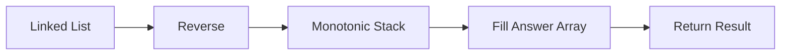
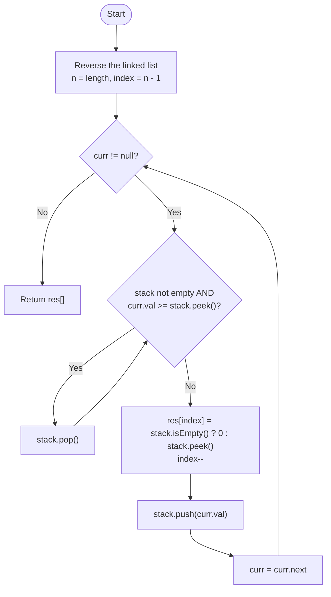
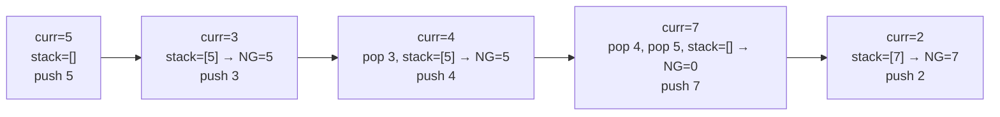
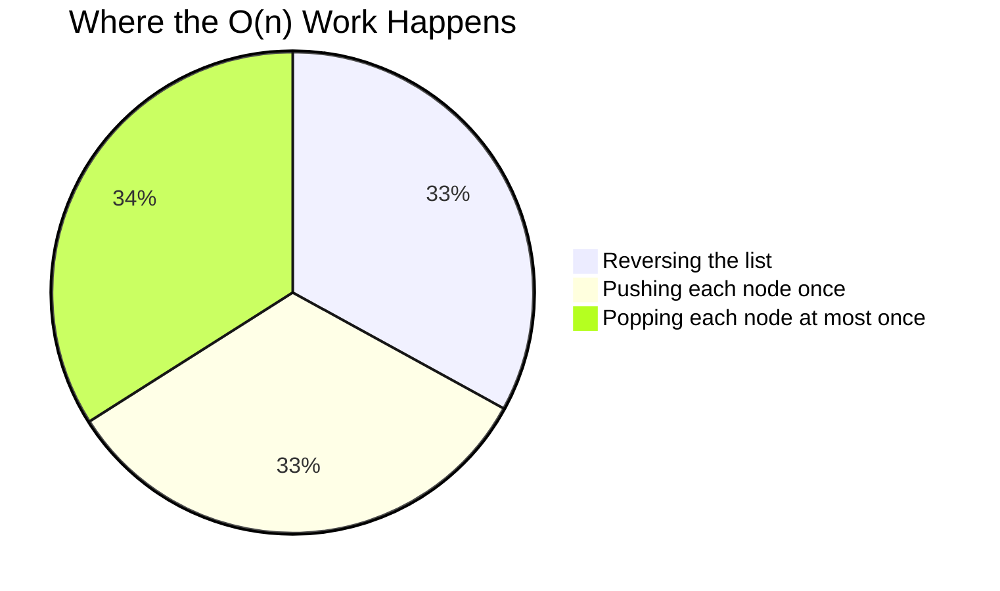
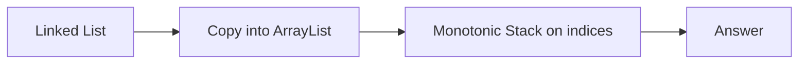

# 🔥 LeetCode 1019 — Next Greater Node In Linked List


-brightgreen)
-yellow)


<div align="center">

### 🔗 [LeetCode Problem Link](https://leetcode.com/problems/next-greater-node-in-linked-list/) &nbsp;|&nbsp; 🏷️ Medium &nbsp;|&nbsp; 🏢 Asked at Amazon, Bloomberg, Microsoft

</div>

---

## 📑 Table of Contents

- [📌 Problem Statement](#-problem-statement)
- [📝 Examples](#-examples)
- [🚀 My Approach](#-my-approach)
- [💡 Why Reverse?](#-why-reverse)
- [🗺️ Flowchart](#️-flowchart)
- [🎯 Key Idea](#-key-idea)
- [📊 Step-by-Step Visualization](#-step-by-step-visualization)
- [🎬 State Table Walkthrough](#-state-table-walkthrough)
- [🌊 Dry Run #2](#-dry-run-2)
- [🧠 Monotonic Stack Illustration](#-monotonic-stack-illustration)
- [✅ Java Solution](#-java-solution)
- [⏱ Complexity Analysis](#-complexity-analysis)
- [⚖️ Approach Comparison](#️-approach-comparison)
- [⚠️ Interview Discussion](#️-interview-discussion)
- [❌ Common Mistakes](#-common-mistakes)
- [🎓 Concepts Learned](#-concepts-learned)
- [🔗 Similar Problems](#-similar-problems)
- [🏆 Key Takeaway](#-key-takeaway)

---

## 📌 Problem Statement

Given the **head** of a singly linked list, return an integer array `answer` where:

```
answer[i] = value of the next greater node of the ith node
```

If no greater node exists:

```
answer[i] = 0
```

---

## 📝 Examples

| Example | Input | Output |
|---|---|---|
| 1 | `2 → 1 → 5` | `[5,5,0]` |
| 2 | `2 → 7 → 4 → 3 → 5` | `[7,0,5,5,0]` |

---

## 🚀 My Approach

Instead of converting the linked list into an array, I **reverse the linked list first**. After reversing, the problem becomes exactly the classic **Next Greater Element** problem.



---

## 💡 Why Reverse?

Original List:

```
2 → 7 → 4 → 3 → 5
```

Finding the next greater element means looking **to the right** — but a singly linked list can't move backwards. So we reverse it:

```
5 → 3 → 4 → 7 → 2
```

Now processing **Left ➜ Right** on the reversed list is equivalent to processing the original list **Right ➜ Left** — exactly what a Monotonic Stack needs.

| Direction Needed | Original List | Reversed List |
|---|---|---|
| Look-ahead (right) | ❌ Not possible | — |
| Look-behind (left) | — | ✅ Natural traversal |

---

## 🗺️ Flowchart



---

## 🎯 Key Idea

Maintain a stack that always ends up exposing a **greater value at the top** relative to what comes next.

Before inserting the current node, remove every element **smaller than or equal to** it:

```
while (stack.top <= current)
    pop()
```

After popping, `stack.top` becomes the Next Greater Node for the current value.

---

## 📊 Step-by-Step Visualization

```
Original:  2 → 7 → 4 → 3 → 5
Reversed:  5 → 3 → 4 → 7 → 2
```



Final Answer:

```
┌────────────────────────────┐
│   Result: [7, 0, 5, 5, 0]   │
└────────────────────────────┘
```

---

## 🎬 State Table Walkthrough

Processing reversed list `5 → 3 → 4 → 7 → 2` (index fills backward, `index` starts at `n-1 = 4`):

| curr | pop while `curr ≥ top` | stack after pop | Next Greater | stack after push | `res[index--]` |
|---|---|---|---|---|---|
| 5 | — | `[]` | `0` | `[5]` | `res[4]=0` |
| 3 | — | `[5]` | `5` | `[5,3]` | `res[3]=5` |
| 4 | pop `3` | `[5]` | `5` | `[5,4]` | `res[2]=5` |
| 7 | pop `4`, pop `5` | `[]` | `0` | `[7]` | `res[1]=0` |
| 2 | — | `[7]` | `7` | `[7,2]` | `res[0]=7` |

Reading `res[0..4]` gives:

```
[7, 0, 5, 5, 0]
```

✅ Matches expected output for `2 → 7 → 4 → 3 → 5`

---

## 🌊 Dry Run #2

Input: `2 → 1 → 5` → Reversed: `5 → 1 → 2`

| curr | stack before | pop? | Next Greater | stack after |
|---|---|---|---|---|
| 5 | `[]` | — | `0` | `[5]` |
| 1 | `[5]` | — | `5` | `[5,1]` |
| 2 | `[5,1]` | pop `1` | `5` | `[5,2]` |

Reverse index filling:

```
res[2] = 0
res[1] = 5
res[0] = 5
```

Result:

```
[5, 5, 0]
```

---

## 🧠 Monotonic Stack Illustration

```
Stack (before)          Current = 6
Top
 │ 7
 │ 5
 │ 4
 │ 3
 └────────────

Pop 3   (3 < 6)
Pop 4   (4 < 6)
Pop 5   (5 < 6)
Stop    (7 ≥ 6)

Stack (after)
Top
 │ 7
 └────────────

Next Greater of 6 = 7
Push 6 → Top
 │ 7
 │ 6
 └────────────
```

---

## ✅ Java Solution

```java
class Solution {

    public int[] nextLargerNodes(ListNode head) {

        ListNode rev = null;
        ListNode curr = head;

        int n = 0;

        while (curr != null) {
            ListNode temp = curr.next;
            curr.next = rev;
            rev = curr;
            curr = temp;
            n++;
        }

        curr = rev;

        int[] res = new int[n];

        Stack<Integer> stack = new Stack<>();

        int index = n - 1;

        while (curr != null) {

            while (!stack.isEmpty() &&
                    curr.val >= stack.peek()) {
                stack.pop();
            }

            res[index--] =
                    stack.isEmpty() ? 0 : stack.peek();

            stack.push(curr.val);

            curr = curr.next;
        }

        return res;
    }
}
```

<details>
<summary>🐍 Python equivalent — no-mutation version using an ArrayList (click to expand)</summary>

```python
class ListNode:
    def __init__(self, val=0, next=None):
        self.val = val
        self.next = next

def next_larger_nodes(head: "ListNode") -> list[int]:
    vals = []
    curr = head
    while curr:
        vals.append(curr.val)
        curr = curr.next

    n = len(vals)
    res = [0] * n
    stack = []  # holds indices

    for i, v in enumerate(vals):
        while stack and vals[stack[-1]] < v:
            res[stack.pop()] = v
        stack.append(i)

    return res
```

This version traverses **left to right** with an index-based stack instead of reversing — no mutation of the input list, same `O(n)` time and space.
</details>

---

## ⏱ Complexity Analysis



| Step | Time | Space |
|---|---|---|
| Reverse linked list | `O(n)` | `O(1)` |
| Stack processing (each node pushed & popped once) | `O(n)` | `O(n)` |
| Result array | — | `O(n)` |
| **Total** | **`O(n)`** | **`O(n)`** |

---

## ⚖️ Approach Comparison

| Approach | Time | Space | Mutates Input? | Notes |
|---|---|---|---|---|
| Brute Force (nested loop per node) | `O(n²)` | `O(n)` | ❌ No | Simple but slow for large lists |
| **Reverse + Monotonic Stack (this solution)** | **`O(n)`** | **`O(n)`** | ✅ Yes | Fast, but permanently reverses the list |
| ArrayList + Monotonic Stack (left→right, index-based) | `O(n)` | `O(n)` | ❌ No | Same complexity, avoids mutation |

---

## ⚠️ Interview Discussion

### Why Reverse?

Because a singly linked list cannot move backwards. Reversing allows the "look ahead to the right" requirement to become a single forward traversal.

### Does This Modify the Input?

✅ Yes — the original linked list is reversed permanently.

If preserving the input is required, a common alternative is:



This avoids mutation while keeping the same asymptotic complexity — see the Python version above.

---

## ❌ Common Mistakes

| ❌ Mistake | ✅ Fix |
|---|---|
| Filling the answer forward with `res[index++]` | Fill backward with `res[index--]` since we're iterating the *reversed* list |
| Using `>` instead of `>=` in the pop condition | Use `curr.val >= stack.peek()` — equal values are **not** "greater" |
| Not checking `stack.isEmpty()` before `stack.peek()` | Always guard with `stack.isEmpty()` or a `NullPointerException`/`EmptyStackException` occurs |
| Forgetting the original list is mutated after reversal | If the caller needs the original order preserved, use the ArrayList-based variant instead |

---

## 🎓 Concepts Learned

✅ Linked List Reversal
✅ Monotonic Stack
✅ Next Greater Element Pattern
✅ Reverse Traversal Simulation
✅ Stack Optimization (each element pushed/popped at most once)

---

## 🔗 Similar Problems

| LeetCode | Problem | Pattern |
|---|---|---|
| 496 | Next Greater Element I | Monotonic Stack |
| 503 | Next Greater Element II | Circular Monotonic Stack |
| 739 | Daily Temperatures | Monotonic Stack |
| 84 | Largest Rectangle in Histogram | Monotonic Stack |
| 42 | Trapping Rain Water | Monotonic Stack |
| 901 | Online Stock Span | Monotonic Stack |
| 1944 | Number of Visible People in a Queue | Monotonic Stack |

---

## 🏆 Key Takeaway

This problem demonstrates how combining two classic techniques —

```
🔄 Linked List Reversal
       +
📚 Monotonic Stack
       =
Next Greater Element pattern in O(n) time
```

— transforms a linked-list problem into a standard array-based pattern while keeping optimal `O(n)` time complexity.

<div align="center">

⭐ If this helped you understand monotonic stacks, consider starring the repo!

</div>
