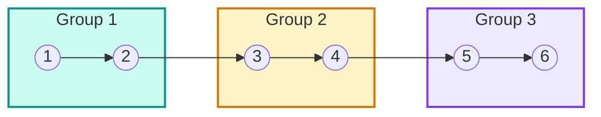
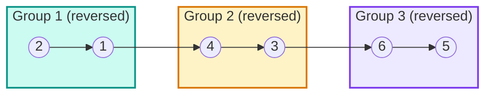
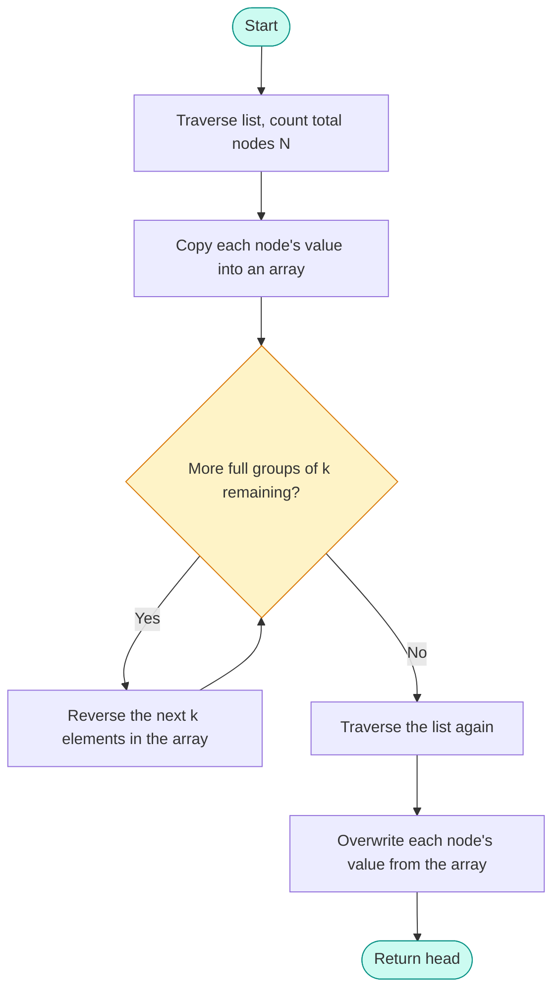
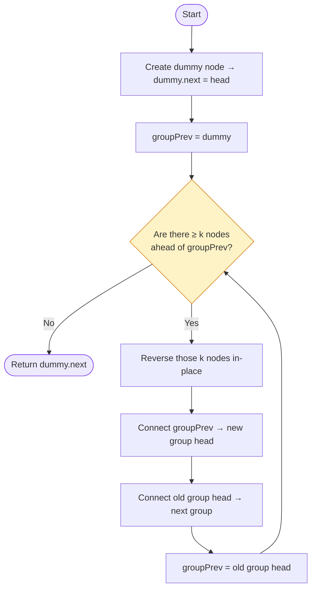
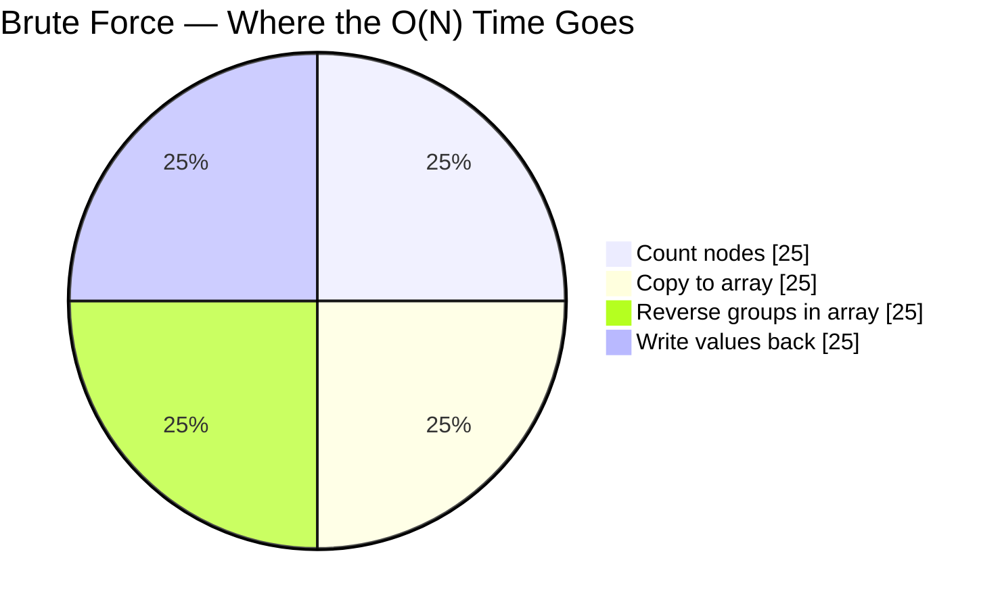
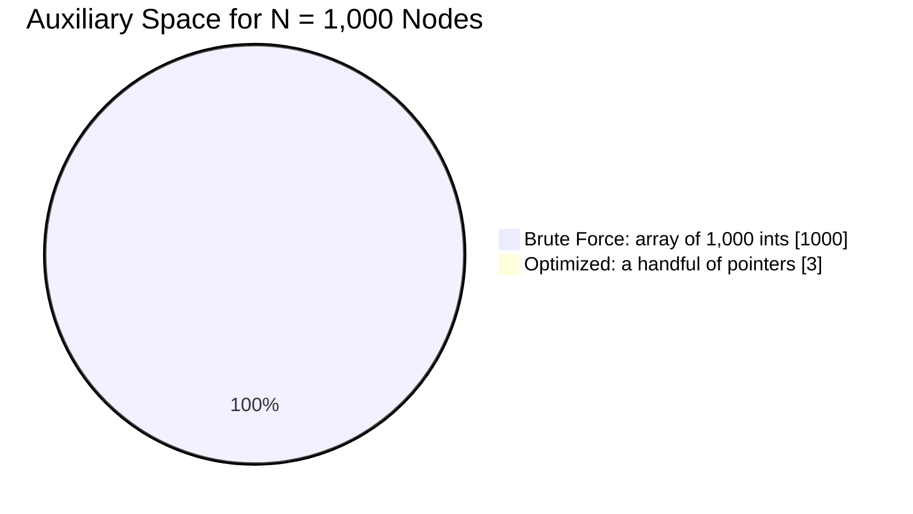

<div align="center">


[+Space+%7C+Pure+Pointer+Manipulation;Hard-Level+Interview+Classic)](https://leetcode.com/problems/reverse-nodes-in-k-group/)


-F59E0B?style=for-the-badge)
-14B8A6?style=for-the-badge)


</div>

<br>

# 🔗 Reverse Nodes in k-Group — LeetCode 25

> Given the head of a linked list, reverse the nodes `k` at a time and return the modified list. If the number of nodes isn't a multiple of `k`, the leftover nodes stay in their original order — and only the **nodes** may move, never the **values**.

🔗 **Source:** [leetcode.com/problems/reverse-nodes-in-k-group](https://leetcode.com/problems/reverse-nodes-in-k-group/)

---

## 📑 Table of Contents

- [📌 Problem Statement](#-problem-statement)
- [🧩 The Big Picture](#-the-big-picture)
- [🚀 My Learning Journey](#-my-learning-journey)
- [🐢 Approach 1: Brute Force (Array-Based)](#-approach-1-brute-force-array-based)
- [⚡ Approach 2: Optimized In-Place Reversal](#-approach-2-optimized-in-place-reversal)
- [📊 Complexity Showdown](#-complexity-showdown)
- [🏆 Approach Comparison](#-approach-comparison)
- [🧠 What I Learned](#-what-i-learned)
- [🎯 Key Takeaway](#-key-takeaway)
- [🎁 Bonus: Recursive Approach](#-bonus-recursive-approach)

<details>
<summary>📎 Shared <code>ListNode</code> definition (assumed by every snippet below)</summary>

```java
public class ListNode {
    int val;
    ListNode next;
    ListNode() {}
    ListNode(int val) { this.val = val; }
    ListNode(int val, ListNode next) { this.val = val; this.next = next; }
}
```

```python
class ListNode:
    def __init__(self, val=0, next=None):
        self.val = val
        self.next = next
```

</details>

---

## 📌 Problem Statement

Given the head of a linked list, reverse the nodes of the list `k` at a time and return the modified list.

> [!IMPORTANT]
> Two rules turn this into a **Hard**, not a Medium:
> 1. If the number of remaining nodes isn't a multiple of `k`, those leftover nodes are left **as they are**.
> 2. The **values inside the nodes cannot be modified** — only the nodes themselves may be rearranged. Swapping `.val` fields instead of relinking pointers quietly breaks this rule, even when the printed sequence looks identical.

---

## 🧩 The Big Picture

Here's what "reverse in groups of `k`" looks like for `k = 2` on a 6-node list. Each color is one group — the internal order flips, but the groups still connect to each other left-to-right in the same sequence:

**Before**



**After**



---

## 🚀 My Learning Journey

Instead of directly jumping to the optimal solution, I solved the problem in two stages:

1. **Brute Force** (Array-Based Approach)
2. **Optimized** (In-Place Pointer Reversal)

This helped me understand the problem first and then optimize the solution.

---

## 🐢 Approach 1: Brute Force (Array-Based)

### Idea

Instead of touching any pointers, sidestep the hard part entirely:

1. Count the total number of nodes.
2. Copy every node's value into an array.
3. Reverse each full group of `k` **inside the array**.
4. Walk the list one more time and overwrite each node's `.val` from the array.

### Algorithm Flow



### Dry Run

Input: `1 → 2 → 3 → 4 → 5 → 6`, `k = 2`

| Step | Action | State |
|---|---|---|
| 1 | Count nodes | `N = 6` |
| 2 | Copy to array | `[1, 2, 3, 4, 5, 6]` |
| 3 | Reverse group `[0:2]` | `[2, 1, 3, 4, 5, 6]` |
| 4 | Reverse group `[2:4]` | `[2, 1, 4, 3, 5, 6]` |
| 5 | Reverse group `[4:6]` | `[2, 1, 4, 3, 6, 5]` |
| 6 | Copy back into list | `2 → 1 → 4 → 3 → 6 → 5` |

### Code

**Java**

```java
class Solution {
    public ListNode reverseKGroup(ListNode head, int k) {
        // Step 1: Count nodes
        int count = 0;
        ListNode node = head;
        while (node != null) {
            count++;
            node = node.next;
        }

        // Step 2: Store values in an array
        int[] values = new int[count];
        node = head;
        int idx = 0;
        while (node != null) {
            values[idx++] = node.val;
            node = node.next;
        }

        // Step 3: Reverse every full group of k in the array
        for (int start = 0; start + k <= count; start += k) {
            reverseRange(values, start, start + k - 1);
        }

        // Step 4: Copy values back into the linked list
        node = head;
        idx = 0;
        while (node != null) {
            node.val = values[idx++];
            node = node.next;
        }

        return head;
    }

    private void reverseRange(int[] arr, int left, int right) {
        while (left < right) {
            int temp = arr[left];
            arr[left] = arr[right];
            arr[right] = temp;
            left++;
            right--;
        }
    }
}
```

<details>
<summary>🐍 Python solution (click to expand)</summary>

```python
class Solution:
    def reverseKGroup(self, head: ListNode, k: int) -> ListNode:
        # Step 1: Count nodes
        count = 0
        node = head
        while node:
            count += 1
            node = node.next

        # Step 2: Store values in a list
        values = []
        node = head
        while node:
            values.append(node.val)
            node = node.next

        # Step 3: Reverse every full group of k
        for start in range(0, count - k + 1, k):
            values[start:start + k] = values[start:start + k][::-1]

        # Step 4: Copy values back into the linked list
        node = head
        idx = 0
        while node:
            node.val = values[idx]
            idx += 1
            node = node.next

        return head
```

</details>

> [!WARNING]
> This passes LeetCode's judge because the judge only checks the final sequence of values — but it doesn't actually satisfy the problem as stated. The node objects never move; only their `.val` fields change. If an interviewer asks "are you sure you're not modifying values?", this is the approach that gets called out.

### Complexity Analysis

| | Complexity | Why |
|---|---|---|
| **Time** | `O(N)` | Four separate `O(N)` passes (count → copy → reverse → write back) still sum to `O(N)` |
| **Space** | `O(N)` | The extra `values` array holds every node's value |

### Pros & Cons

| ✅ Pros | ❌ Cons |
|---|---|
| Very easy to understand | Uses extra memory |
| Simple implementation | Does not actually reverse the nodes |
| Good first solution while learning | Modifies node values instead of changing node connections |
| | Does not satisfy the follow-up requirement of the problem |

---

## ⚡ Approach 2: Optimized In-Place Reversal

### Idea

Skip the array entirely and reverse the actual pointers, one group of `k` at a time:

1. Add a dummy node before `head` so the very first group doesn't need special-casing.
2. Look `k` nodes ahead of the last finished group. If fewer than `k` nodes remain, stop — those nodes stay untouched.
3. Reverse the `k` nodes in that window using the classic three-pointer (`prev` / `curr` / `next`) dance.
4. Splice the reversed window back between the previous group and the next one.
5. Repeat until fewer than `k` nodes remain.

### Algorithm Flow



### Visual Dry Run

Input: `1 → 2 → 3 → 4 → 5 → 6`, `k = 2`. Each row is one loop iteration — the **bold** pair is the group that just got flipped.

| Iteration | `groupPrev` before | Group window | `kth` (new group head) | `groupNext` | List state after |
|---|---|---|---|---|---|
| 1 | `dummy` | `1 → 2` | `2` | `3` | **2 → 1** → 3 → 4 → 5 → 6 |
| 2 | `1` | `3 → 4` | `4` | `5` | 2 → 1 → **4 → 3** → 5 → 6 |
| 3 | `3` | `5 → 6` | `6` | `null` | 2 → 1 → 4 → 3 → **6 → 5** |
| 4 | `5` | *(0 nodes left)* | `null` | — | 🛑 loop breaks → return `dummy.next` |

**Final result:** `2 → 1 → 4 → 3 → 6 → 5`

### Edge Case: Leftover Nodes

The case the first example never tests. Input: `1 → 2 → 3 → 4 → 5 → 6 → 7`, `k = 3`

```
Group 1 (1, 2, 3) → reversed → 3, 2, 1
Group 2 (4, 5, 6) → reversed → 6, 5, 4
Leftover (7)      → only 1 node, < k → left untouched
```

**Final result:** `3 → 2 → 1 → 6 → 5 → 4 → 7`

### Code

**Java**

```java
class Solution {
    public ListNode reverseKGroup(ListNode head, int k) {
        // Dummy node avoids special-casing the very first group
        ListNode dummy = new ListNode(0);
        dummy.next = head;
        ListNode groupPrev = dummy;

        while (true) {
            // Step 1: Check whether k nodes exist ahead of groupPrev
            ListNode kth = getKthNode(groupPrev, k);
            if (kth == null) break;
            ListNode groupNext = kth.next;

            // Step 2: Reverse the k nodes in this window
            ListNode prev = groupNext;
            ListNode curr = groupPrev.next;
            while (curr != groupNext) {
                ListNode temp = curr.next;
                curr.next = prev;
                prev = curr;
                curr = temp;
            }

            // Step 3: Reconnect the reversed window to its neighbors
            ListNode temp = groupPrev.next; // old head is now the tail
            groupPrev.next = kth;
            groupPrev = temp;
        }

        return dummy.next;
    }

    private ListNode getKthNode(ListNode curr, int k) {
        while (curr != null && k > 0) {
            curr = curr.next;
            k--;
        }
        return curr;
    }
}
```

<details>
<summary>🐍 Python solution (click to expand)</summary>

```python
class Solution:
    def reverseKGroup(self, head: ListNode, k: int) -> ListNode:
        dummy = ListNode(0)
        dummy.next = head
        group_prev = dummy

        while True:
            kth = self.get_kth_node(group_prev, k)
            if not kth:
                break
            group_next = kth.next

            prev, curr = group_next, group_prev.next
            while curr != group_next:
                curr.next, prev, curr = prev, curr, curr.next

            temp = group_prev.next
            group_prev.next = kth
            group_prev = temp

        return dummy.next

    def get_kth_node(self, curr, k):
        while curr and k > 0:
            curr = curr.next
            k -= 1
        return curr
```

</details>

### Complexity Analysis

| | Complexity | Why |
|---|---|---|
| **Time** | `O(N)` | Every node is visited a constant number of times |
| **Space** | `O(1)` | Only a handful of pointer variables — no extra data structures |

### Pros & Cons

| ✅ Pros | ❌ Cons |
|---|---|
| Uses constant extra space | Pointer manipulation is more complex |
| Reverses the actual nodes | Easier to introduce pointer-related bugs if not handled carefully |
| Meets the expected interview solution | |
| Efficient and scalable | |

---

## 📊 Complexity Showdown

**Why 4 passes is still `O(N)`** — Approach 1 walks the list four separate times, but four back-to-back linear passes are still linear overall:



**Why space is the real deciding factor** — for a list of 1,000 nodes, here's the actual auxiliary memory each approach allocates:



Both approaches are `O(N)` in time — only one is `O(1)` in space, and that's usually what separates a "correct" answer from a "strong" one in an interview.

---

## 🏆 Approach Comparison

| Feature | 🐢 Array-Based | ⚡ Pointer-Based |
|---|:---:|:---:|
| Time Complexity | `O(N)` | `O(N)` |
| Space Complexity | `O(N)` | `O(1)` |
| Reverses Values | ✅ Yes | ❌ No |
| Reverses Nodes | ❌ No | ✅ Yes |
| Interview Preferred | ❌ No | ✅ Yes |
| Easy to Implement | ⭐⭐⭐⭐⭐ | ⭐⭐⭐☆☆ |
| Memory Efficient | ❌ No | ✅ Yes |
| Production Ready | ❌ No | ✅ Yes |

---

## 🧠 What I Learned

- ✅ How to transform a linked list into an array for easier manipulation.
- ✅ Why modifying node values is different from rearranging node pointers.
- ✅ How to reverse a linked list using pointer manipulation.
- ✅ How to reconnect multiple reversed groups correctly.
- ✅ The importance of using a dummy node to simplify edge cases.
- ✅ How to optimize a brute-force solution into an in-place algorithm.

---

## 🎯 Key Takeaway

> My first solution focused on **correctness**, while my second solution focused on **optimization**.
>
> This problem taught me that solving a problem in stages — starting with a simple working solution and then improving it — is an effective way to build problem-solving skills and prepare for coding interviews.

---

## 🎁 Bonus: Recursive Approach

Not part of the original two-stage journey, but worth knowing for the inevitable "can you also do it recursively?" follow-up.

**Idea:** Check if `k` nodes exist from `head`. If not, return `head` untouched. If they do, recursively solve the *rest* of the list first, then reverse the current `k`-node window and point its tail at whatever the recursive call already fixed up.

```java
class Solution {
    public ListNode reverseKGroup(ListNode head, int k) {
        // Step 1: Confirm at least k nodes exist from head
        ListNode node = head;
        int count = 0;
        while (node != null && count < k) {
            node = node.next;
            count++;
        }
        if (count < k) return head; // fewer than k left — leave untouched

        // Step 2: Recursively reverse everything after this group first
        ListNode newHead = reverseKGroup(node, k);

        // Step 3: Reverse the current group, connecting to the recursive result
        ListNode prev = newHead;
        ListNode curr = head;
        for (int i = 0; i < k; i++) {
            ListNode temp = curr.next;
            curr.next = prev;
            prev = curr;
            curr = temp;
        }

        return prev; // new head of this group
    }
}
```

<details>
<summary>🐍 Python solution (click to expand)</summary>

```python
class Solution:
    def reverseKGroup(self, head: ListNode, k: int) -> ListNode:
        node, count = head, 0
        while node and count < k:
            node = node.next
            count += 1
        if count < k:
            return head

        new_head = self.reverseKGroup(node, k)

        prev, curr = new_head, head
        for _ in range(k):
            temp = curr.next
            curr.next = prev
            prev = curr
            curr = temp

        return prev
```

</details>

> [!NOTE]
> Same `O(N)` time as the iterative version, but recursion adds `O(N/k)` space on the call stack — worth mentioning out loud if an interviewer asks you to compare the two.

<br>

<div align="center">

⭐ **If this walkthrough helped, a star on the repo goes a long way.**


</div>
