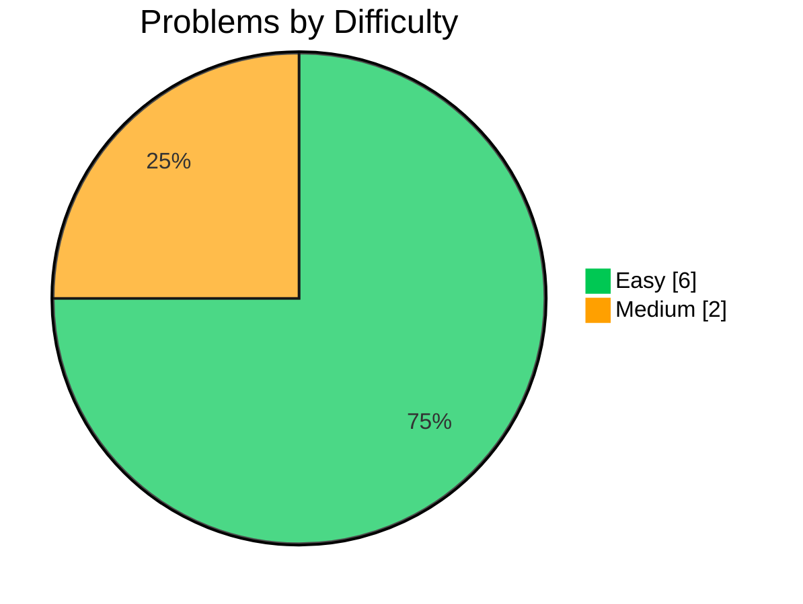

 

 

## 📑 Table of Contents

- [About](#about)
- [Tech Stack](#tech-stack)
- [Topics Covered](#topics-covered)
- [Concepts Practiced](#concepts-practiced)
- [Problem Solving Platforms](#problem-solving-platforms)
- [Progress Snapshot](#progress-snapshot)
- [Problem Index](#problem-index)
- [Goals](#goals)
- [Current Focus](#current-focus)
- [Future Roadmap](#future-roadmap)
- [Author](#author)

---

## About

A professionally structured, topic-wise collection of Data Structures & Algorithms solutions in **Java** — built to sharpen problem-solving instincts, strengthen algorithmic thinking, and stay interview-ready for product-based tech company hiring.

Maintained by a final-year B.Tech (AI & Data Science) student actively preparing for SDE interviews. Every solved problem lives in its own folder under its topic (e.g. `Array/Two Sum/`), so you can jump straight to a solution, read the approach, and see the code.

**This repo is built around:**
- 🧩 Problem-solving skills
- 🧠 Algorithmic thinking
- 💼 Coding interview preparation
- 🏆 Competitive programming skills

## Tech Stack

## Topics Covered

## Concepts Practiced

## Problem Solving Platforms

## Progress Snapshot

*(Counts reflect problems currently indexed below — update as you add more.)*

## Problem Index

<!-- If ALGOVAULT:STATS is regenerated by a script or GitHub Action, update that generator's template too, or the next run will overwrite the styling below. -->
<!-- ALGOVAULT:STATS:START -->

<b>Array</b> — 4 problems

| # | Problem | Difficulty |
|:---:|:---|:---:|
| 1 | [Two Sum](./Array/Two%20Sum/) |  |
| 134 | [Gas Station](./Array/Gas%20Station/) |  |
| 821 | [Shortest Distance to a Character](./Array/Shortest%20Distance%20to%20a%20Character/) |  |
| 1331 | [Rank Transform of an Array](./Array/Rank%20Transform%20of%20an%20Array/) |  |

<b>Enumeration</b> — 1 problem

| # | Problem | Difficulty |
|:---:|:---|:---:|
| 1291 | [Sequential Digits](./Enumeration/Sequential%20Digits/) |  |

<b>General</b> — 1 problem

| # | Problem | Difficulty |
|:---:|:---|:---:|
| — | [Check If Digits Are Equal in String After Operations I](./General/Check%20If%20Digits%20Are%20Equal%20in%20String%20After%20Operations%20I/) |  |

<b>Math</b> — 1 problem

| # | Problem | Difficulty |
|:---:|:---|:---:|
| 3461 | [Check If Digits Are Equal in String After Operations I](./Math/Check%20If%20Digits%20Are%20Equal%20in%20String%20After%20Operations%20I/) |  |

<b>Two Pointers</b> — 1 problem

| # | Problem | Difficulty |
|:---:|:---|:---:|
| 680 | [Valid Palindrome II](./Two%20Pointers/Valid%20Palindrome%20II/) |  |

<i>Building Technical Excellence Through Consistent Problem Solving.</i>

<!-- ALGOVAULT:STATS:END -->

## Goals

- [ ] Solve problems consistently
- [ ] Strengthen DSA fundamentals
- [ ] Prepare for coding interviews
- [ ] Build strong problem-solving ability

## Current Focus

> 🔥 **Currently diving into:** Graph Algorithms · BFS & DFS · Dynamic Programming · Advanced HashMap Problems

## Future Roadmap

- [ ] Segment Tree
- [ ] Fenwick Tree
- [ ] Trie
- [ ] Disjoint Set Union (DSU)
- [ ] Advanced Graph Algorithms
- [ ] System Design Notes

## Author

**Hemnath Kandasamy**

Final-year B.Tech (AI & Data Science) student · Building interview-ready projects for product-based companies

 

