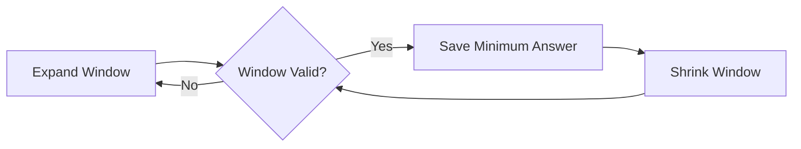
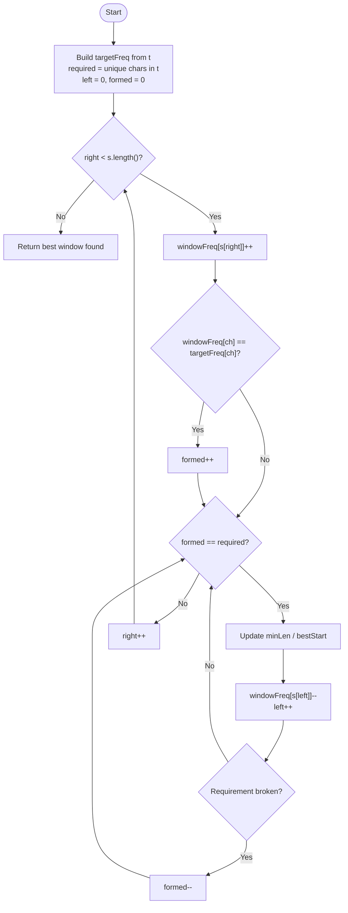
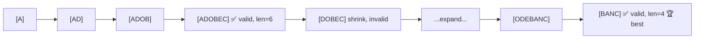
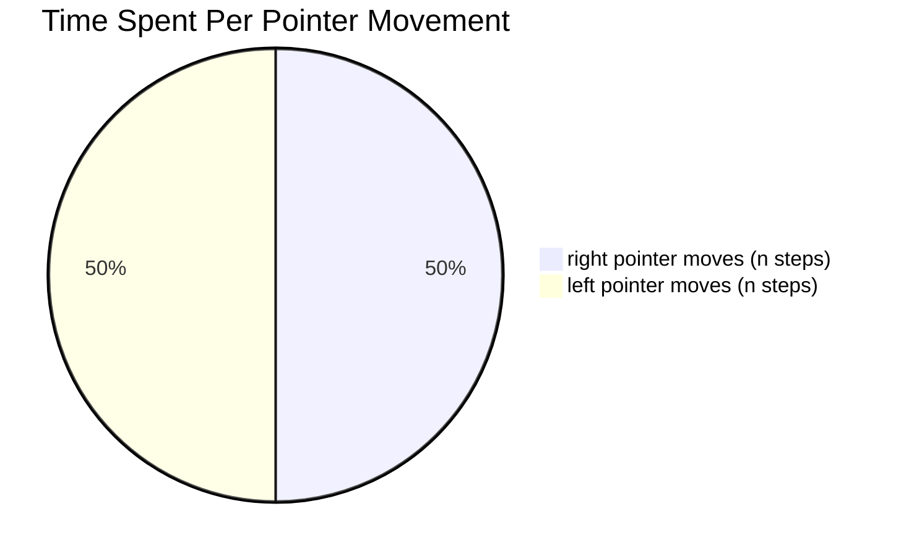

# 🪟 LeetCode 76 — Minimum Window Substring


-brightgreen)
-orange)


<div align="center">

### 🔗 [LeetCode Problem Link](https://leetcode.com/problems/minimum-window-substring/) &nbsp;|&nbsp; 🏷️ Hard &nbsp;|&nbsp; 🏢 Asked at Meta, Amazon, Google, Uber

</div>

---


## 📖 Problem

Given two strings:

```
s = "ADOBECODEBANC"
t = "ABC"
```

Return the **smallest substring** of `s` that contains **all characters** of `t` (including duplicates).

| Input | Value |
|---|---|
| `s` | `ADOBECODEBANC` |
| `t` | `ABC` |
| **Output** | **`BANC`** |
| Output Length | `4` |

> 💭 If no such substring exists, return an empty string `""`.

---

## 💡 Intuition

Instead of checking every possible substring (which is `O(n²)` or worse), we maintain a **Sliding Window** that grows and shrinks over `s`.



---

## 🧠 Key Idea

We maintain four pieces of state:

| Variable | Meaning |
|---|---|
| `targetFreq[]` | Frequency of each character required from `t` |
| `windowFreq[]` | Frequency of each character currently inside the window |
| `required` | Number of **unique** characters needed to satisfy `t` |
| `formed` | Number of unique characters **currently satisfied** in the window |

```
             formed == required
                     ⇩
     Window contains every required character ✅
```

---

## 🗺️ Flowchart



---

## 📊 Step-by-Step Visualization

```
s = A D O B E C O D E B A N C
    0 1 2 3 4 5 6 7 8 9 ...
```

### Phase 1 — Expand until the window is valid

```
Step 1:  [A]                       formed=1  required=3
Step 2:  [A D O B]                 formed=2  required=3
Step 3:  [A D O B E C]             formed=3  required=3   ✅ VALID
```

### Phase 2 — Shrink while still valid, save the best answer

```
Window:  [A D O B E C]   length=6   ← candidate answer
Remove 'A' (left++)
Window:   D O B E C      formed=2   ❌ INVALID → stop shrinking, expand again
```

### Phase 3 — Keep expanding/shrinking across the string



### Final Result

```
┌─────────────────────────────────┐
│   Smallest Valid Window: BANC    │
│   Length: 4                      │
└─────────────────────────────────┘
```

---

## 🎬 State Table Walkthrough

| `right` | char added | window | `formed` | valid? | action |
|---|---|---|---|---|---|
| 0 | A | `A` | 1 | ❌ | expand |
| 1 | D | `AD` | 1 | ❌ | expand |
| 2 | O | `ADO` | 1 | ❌ | expand |
| 3 | B | `ADOB` | 2 | ❌ | expand |
| 4 | E | `ADOBE` | 2 | ❌ | expand |
| 5 | C | `ADOBEC` | 3 | ✅ | **save `ADOBEC` (len 6)**, shrink → drop `A` |
| 6 | O | `DOBEC` → `DOBECO` | 2 | ❌ | expand |
| 7 | D | `DOBECOD` | 2 | ❌ | expand |
| 8 | E | `DOBECODE` | 2 | ❌ | expand |
| 9 | B | `DOBECODEB` | 2 | ❌ | expand |
| 10 | A | `DOBECODEBA` | 3 | ✅ | shrink → drop `D,O,B,E,C,O,D,E` until invalid |
| 11 | N | `BANC` window forming | 3 | ✅ | **save `BANC` (len 4)** 🏆 |
| 12 | C | — | — | — | loop ends |

> 🏆 Minimum window found: **`BANC`**

---

## 🎯 Algorithm (Pseudocode)

```
Initialize targetFreq[], windowFreq[]
required = number of unique chars in t
formed = 0, left = 0

for right in 0 .. s.length-1:
    add s[right] to windowFreq
    if windowFreq[ch] == targetFreq[ch]:
        formed++

    while formed == required:
        update best answer (right - left + 1)
        remove s[left] from windowFreq
        if windowFreq[removed] < targetFreq[removed]:
            formed--
        left++

return best answer or ""
```

---

## 🚀 Java Solution

```java
class Solution {

    public String minWindow(String s, String t) {

        if (s.length() < t.length())
            return "";

        int[] targetFreq = new int[128];
        int[] windowFreq = new int[128];

        int required = 0;

        for (char c : t.toCharArray()) {
            if (targetFreq[c] == 0)
                required++;
            targetFreq[c]++;
        }

        int formed = 0;
        int left = 0;

        int bestStart = 0;
        int minLen = Integer.MAX_VALUE;

        for (int right = 0; right < s.length(); right++) {

            char ch = s.charAt(right);
            windowFreq[ch]++;

            if (targetFreq[ch] > 0 &&
                windowFreq[ch] == targetFreq[ch])
                formed++;

            while (formed == required) {

                if (right - left + 1 < minLen) {
                    minLen = right - left + 1;
                    bestStart = left;
                }

                char remove = s.charAt(left);
                windowFreq[remove]--;

                if (targetFreq[remove] > 0 &&
                    windowFreq[remove] < targetFreq[remove])
                    formed--;

                left++;
            }
        }

        return minLen == Integer.MAX_VALUE
                ? ""
                : s.substring(bestStart, bestStart + minLen);
    }
}
```

<details>
<summary>🐍 Python equivalent (click to expand)</summary>

```python
from collections import Counter

def min_window(s: str, t: str) -> str:
    if len(s) < len(t):
        return ""

    target_freq = Counter(t)
    window_freq = {}
    required = len(target_freq)
    formed = 0

    left = 0
    best_len, best_start = float("inf"), 0

    for right, ch in enumerate(s):
        window_freq[ch] = window_freq.get(ch, 0) + 1

        if ch in target_freq and window_freq[ch] == target_freq[ch]:
            formed += 1

        while formed == required:
            if right - left + 1 < best_len:
                best_len = right - left + 1
                best_start = left

            left_ch = s[left]
            window_freq[left_ch] -= 1
            if left_ch in target_freq and window_freq[left_ch] < target_freq[left_ch]:
                formed -= 1
            left += 1

    return "" if best_len == float("inf") else s[best_start:best_start + best_len]
```
</details>

---

## ⏱ Complexity



| Metric | Value | Why |
|---|---|---|
| **Time** | `O(n + m)` | Each char enters the window once (`right`) and leaves once (`left`); `m` = length of `t` |
| **Space** | `O(1)` | Fixed-size 128-length ASCII frequency arrays |

---

## ⚖️ Approach Comparison

| Approach | Time | Space | Notes |
|---|---|---|---|
| Brute Force (all substrings) | `O(n³)` | `O(1)` | Generates every substring, checks validity — far too slow |
| Brute Force + HashMap check | `O(n² · m)` | `O(m)` | Faster validity check, still quadratic in `n` |
| **Sliding Window (this solution)** | **`O(n + m)`** | **`O(1)`** | ✅ Optimal — each index visited a constant number of times |

---

## 🎓 Interview Takeaways

✅ Sliding Window
✅ Frequency Array
✅ Two Pointers
✅ `formed` vs `required` trick avoids re-comparing full frequency maps
✅ Incremental State Maintenance
✅ Recognizing when to shrink vs expand

---

## ⭐ Common Mistakes

| ❌ Mistake | ✅ Fix |
|---|---|
| Comparing full frequency arrays every iteration with `isEqual(freq1, freq2)` | Track `formed` incrementally instead |
| Using `<=` instead of `<` when shrinking the window | Only shrink strictly `while (formed == required)` |
| Forgetting duplicate characters in `t` (e.g. `t = "AABC"` needs 2 `A`s) | Always build `targetFreq` with full counts, not just presence |
| Shrinking past the point where the window is still valid | Update the answer **before** removing from the left |
| Off-by-one on window length (`right - left` vs `right - left + 1`) | Length is always `right - left + 1` |

---

## 🧩 Related Problems

Mastering this pattern unlocks a whole family of sliding-window problems:

| # | Problem | Difficulty |
|---|---|---|
| 3 | Longest Substring Without Repeating Characters | Medium |
| 340 | Longest Substring with At Most K Distinct Characters | Medium |
| 424 | Longest Repeating Character Replacement | Medium |
| 438 | Find All Anagrams in a String | Medium |
| 567 | Permutation in String | Medium |
| **76** | **Minimum Window Substring** | **Hard** |
| 992 | Subarrays with K Different Integers | Hard |

---

## 🏆 Final Notes

This problem teaches one of the most important interview patterns:

```
Sliding Window
      +
Frequency Counting
      +
formed / required Optimization
      =
O(n) substring search
```

<div align="center">

⭐ If this helped you understand sliding windows, consider starring the repo!

</div>
